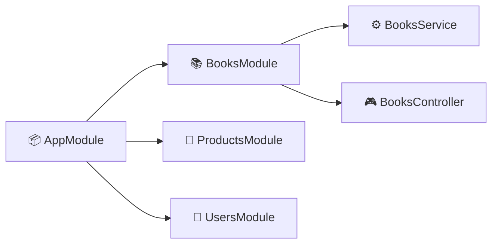
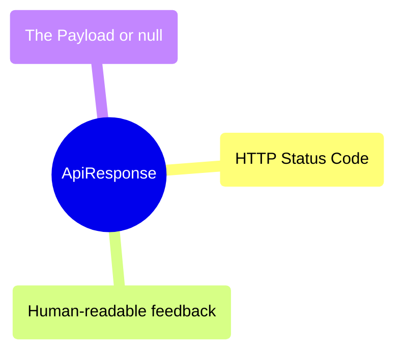
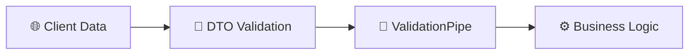
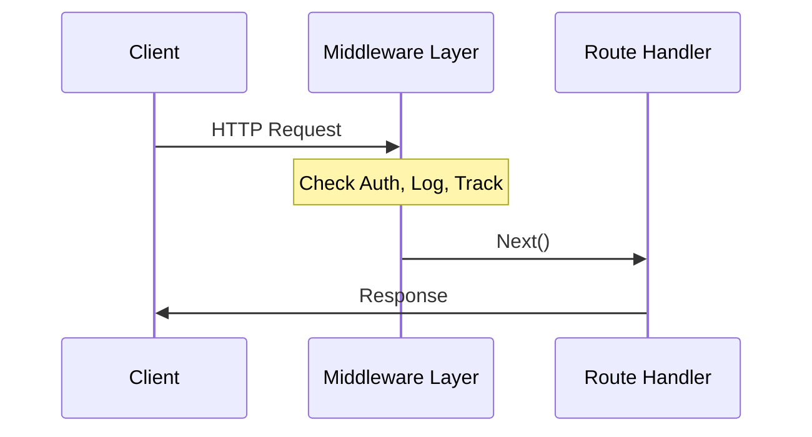

# Codebase Analysis & Best Practices

Welcome to the team! This document breaks down the advanced patterns used in this codebase. Understanding these will help you write scalable, professional-grade NestJS applications.

---

## 🏛️ 1. Modular Architecture
We don't put all our code in one place. Each feature (Books, Products, Users) has its own **Module**.

- **Benefit**: Encapsulation. Changes in `Products` won't accidentally break `Users`.
- **Look for**: `src/users/users.module.ts`.

---

## 📦 2. Consistent API Contract (`ApiResponse`)
Every request, whether successful or an error, returns the same JSON structure.

- **Why?**: The frontend team only needs to write one "Response Handler". It makes the API predictable and professional.
- **Look for**: `src/types/api-response.interface.ts`.

---

## 🛡️ 3. Defensive Programming (DTOs & Validation)
We never trust the client. Incoming data goes through a rigid validation pipeline:

- **Tools**: `class-validator` and `ValidationPipe`.
- **Benefit**: Blocks malicious or malformed data before it even hits our database logic.

---

## 🧱 4. Separation of Concerns (Service vs Controller)
- **Controller**: Only handles the HTTP layer (routing, status codes, Swagger docs).
- **Service**: Handles the "Business Logic" (calculating prices, searching users).

---

## ⚙️ 5. The Middleware Pipeline
We use a chain of decorators and middlewares to keep our controllers clean. In NestJS, middlewares run **before** your route handlers, allowing you to intercept requests and response objects.

---

## 🚀 Pro-Tips for Success
- **Stay Typed**: Avoid `any` at all costs. It defeats the purpose of TypeScript. If you don't know the type, research it or create an interface!
- **DRY (Don't Repeat Yourself)**: Use **Mapped Types** (`PartialType`, `OmitType`) to reuse your DTO definitions.
- **Global Filters**: If you need to change the error format for the whole app, edit `src/common/filters/http-exception.filter.ts`. 
- **Rate Limiting**: Always protect your public endpoints with a rate limiter (Throttler) to prevent abuse and brute-force attacks.

---
*Happy Coding!*
