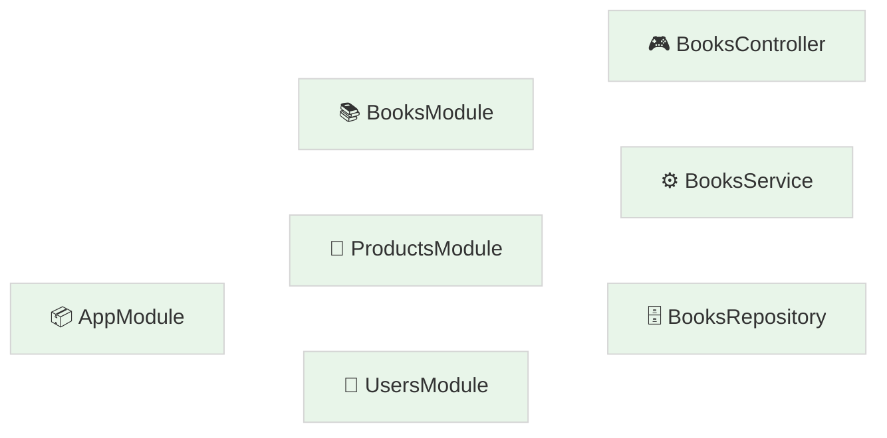
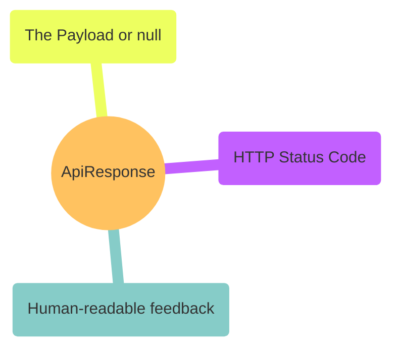
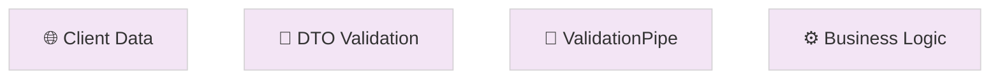
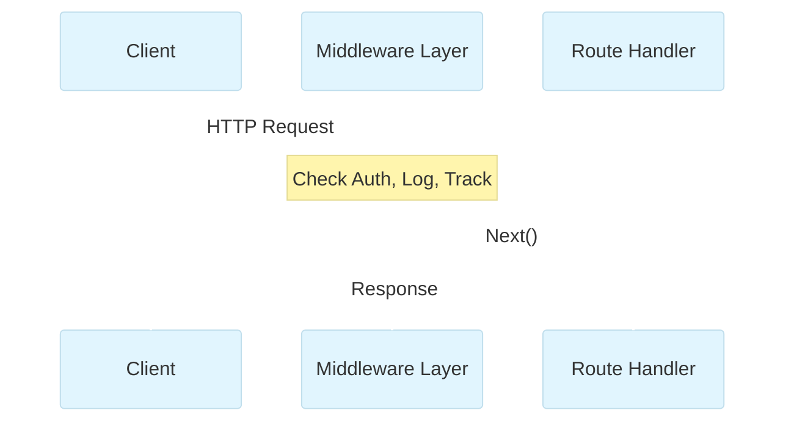

# Codebase Analysis & Best Practices

Welcome back! If the `README.md` is our "User Manual," this document is our "Engineering Blueprint." Here, we deep-dive into the architectural patterns and professional standards that make this codebase scalable, robust, and industry-ready.

---

## 🏛️ 1. Modular Architecture: The LEGO Principle

**What is it?**
Instead of one giant "God Object" or folder, we treat each feature (Books, Products, Users) as an independent LEGO brick. Each one is a **Module**.

**Benefit**:

- **Encapsulation**: If the `Books` logic breaks, the `Users` system remains untouched.
- **Portability**: You can easily lift an entire module and move it to another project.
- **Team Scale**: Multiple developers can work on different modules without constantly hitting merge conflicts.

**Look for**:

- `src/users/users.module.ts` to see how we bundle controllers, services, and repositories together.

---

## 📦 2. Consistent API Contract (`ApiResponse`)

**What is it?**
Consistency is the mark of a professional. we ensure that _every_ response—whether it's a 200 OK or a 404 Not Found—follows the exact same JSON structure.

**Benefit**:

- **Frontend Joy**: The frontend team (or your future self) only needs to write _one_ logic handler for all API calls.
- **Predictability**: No more guessing if the data will be in `response.data` or `response.body`.

**Look for**:

- `src/types/api-response.interface.ts` for the blueprint.
- `src/products/products.service.ts` to see it in action.

---

## 🛡️ 3. Defensive Programming (DTOs & Validation)

**What is it?**
The internet is a wild place. We **never** trust incoming data. We use **Data Transfer Objects (DTOs)** as "Digital Bouncers" that inspect every piece of data before it enters our systems.

**Benefit**:

- **Security**: Prevents malicious actors from injecting unexpected fields into our database.
- **Cleanliness**: Keeps "dirty" data out of our beautiful business logic.

**Look for**:

- `src/users/dto/create-user.dto.ts` (The blueprint).
- `src/main.ts` (Where we active the `ValidationPipe`).

---

## 🧱 4. Separation of Concerns (Three-Tier Architecture)

**What is it?**
A clean codebase has clear boundaries. We follow the industry-standard Three-Tier approach:

- **1. Controller (The Receptionist)**: Validates the request and directs traffic. It doesn't know _how_ to save data; it just knows _who_ to call.
- **2. Service (The Executive)**: The "Brain." This is where calculations, business rules, and logic happen.
- **3. Repository (The Librarian)**: The only person allowed to touch the bookshelf (database). It handles finding and saving raw data.

**Benefit**:

- **Testability**: You can test the "Brain" (Service) without needing to actually talk to a database.
- **Flexibility**: Want to switch from Mock data to PostgreSQL? You only need to change the Repository!

---

## ⚙️ 5. The Middleware Pipeline

**What is it?**
Think of Middleware as a series of checkpoints on a highway. Before a request hits its destination (The Controller), it must pass through these custom and standard gates.

**Benefit**:

- **DRY Logic**: Instead of writing "Check API Key" in 50 controllers, you write it once in a middleware and apply it everywhere.

---

## 🔄 6. The Journey of a Request (Our Codebase Lifecycle)

**What is it?**
This is the roadmap of how a single request travels through our specific application.

### The Execution Order in Our App:

1.  **Middlewares**: Our first line of defense (Custom Loggers, API Key Auth, and Request UUID Tracking).
2.  **Guards**: Our `ThrottlerGuard` protecting us from brute-force attacks.
3.  **Pipes**: This is where our DTOs are checked for "dirty" data.
4.  **Controller**: The traffic conductor.
5.  **Service**: The logic "Brain".
6.  **Repository**: The dedicated database touch-point.
7.  **Exception Filters**: If anything fails, our `HttpExceptionFilter` ensures the error response is still professional.

---

## 🚀 Pro-Tips for Success

- **Stay Typed**: Never use `any`. It’s like driving with your eyes closed.
- **Keep it DRY**: Use **Mapped Types** (`PartialType`) to keep your DTOs clean.
- **Observe Everything**: Leverage our custom loggers and Morgan to see what your app is doing in real-time.

---

_Happy Engineering!_
