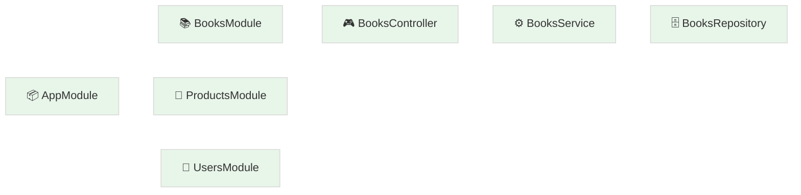
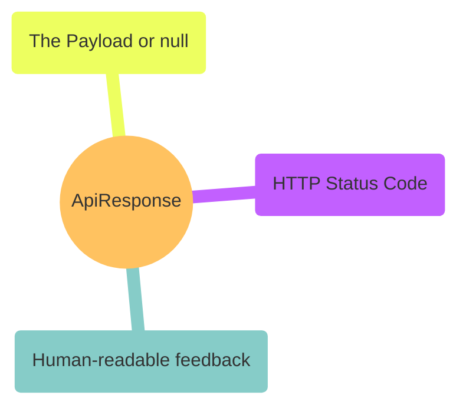
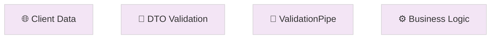
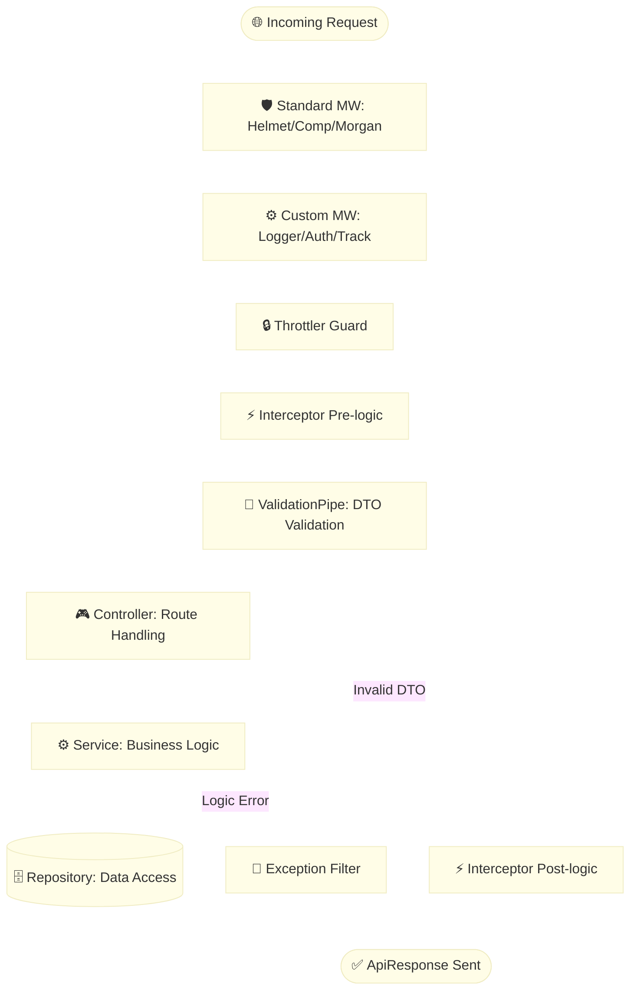

# Codebase Analysis & Best Practices

Welcome back! If the `README.md` is our "User Manual," this document is our "Engineering Blueprint." Here, we’re going to step behind the curtain and look at the engineering decisions that make this codebase production-ready. Think of this as a mentor-led walkthrough of the project's DNA.

---

## 🏛️ Building with Modules: The LEGO Principle

The first thing you’ll notice is that we don’t just throw code into folders. We treat each feature—whether it’s Books, Products, or Users—as a self-contained LEGO brick. In NestJS, we call these **Modules**.

By encapsulating everything this way, we get **Encapsulation** for free. If the logic in the `Books` module needs a massive overhaul, you can work on it without ever worrying about accidentally breaking the `Users` system. It’s also incredibly portable—if you need this `Users` logic in another project, you can practically lift the whole folder and go. Peek into `src/users/users.module.ts` to see how we bundle our controllers, services, and repositories into one neat package.

---

## 📦 Consistency is Key: The `ApiResponse` Contract

Professionalism in API design often comes down to one word: predictability. When a frontend developer uses our API, they should never have to guess what the response looks like. That’s why we created a **Consistent API Contract**.

Whether it’s a success story (200 OK) or an error (404 Not Found), every single response follows the same JSON structure defined in `src/types/api-response.interface.ts`. This makes the frontend’s job easy: they write one "Response Handler" and they’re done. No more hunting for data in `response.body` one day and `response.data` the next.

---

## 🛡️ Trust but Verify: DTOs & The Validation Pipeline

The internet is a wild place, and we never trust data coming from the outside. We use **Data Transfer Objects (DTOs)** as our "Digital Bouncers." Before a single byte hits our business logic, it has to pass through a rigid validation pipeline.

We’ve paired these DTOs with Nest’s `ValidationPipe` (which you can see activated in `src/main.ts`). This ensures that if someone tries to send us "dirty" data or extra fields we didn't ask for, the request is blocked before it can do any harm. It keeps our services clean and our database safe.

---

## 🧱 Keeping Roles Clear: The Three-Tier Architecture

One of the most important patterns in this codebase is the **Separation of Concerns**. We follow a classic Three-Tier approach to make sure nobody is doing too much:

1.  **The Controller (The Conductor)**: This is our HTTP head-end. Its only job is to receive the request, validate the DTO, and hand it off to the right person.
2.  **The Service (The Brain)**: This is where the magic happens. Calculations, business rules, and complex logic live here.
3.  **The Repository (The Librarian)**: The only part of the app allowed to touch our data. Whether it's a mock file or a real PostgreSQL database, the Service just asks the Repository for what it needs.

This setup makes **Testability** a breeze. You can test your "Brain" (Service) without ever needing a real database attached!

---

## 🔄 The Request’s Journey: A Project Lifecycle

To really understand this codebase, you need to see the roadmap of how a single request travels from the moment it hits our server until we send a response back.

Notice how we’ve strategically placed our **Middlewares** right at the front. They act as our first line of defense, handling security (`Helmet`), logging (`Morgan`), and tracking before the request even gets "heavy." If anything fails along this journey, our `HttpExceptionFilter` is there to catch the fall and ensure the user still gets a professional error message.

---

## 🚀 Pro-Tips for Success
- **Stay Typed**: Avoid `any` like the plague. It defeats the purpose of TypeScript and hides bugs.
- **Keep it DRY**: Use **Mapped Types** (like `PartialType`) to reuse your DTO definitions.
- **Observe**: Keep your terminal open. Our custom loggers and Morgan are there to tell you exactly how your code is performing in real-time.

---

## ✍️ Author

**Alvian Zachry Faturrahman**

- Web: [alvianzf.id](https://alvianzf.id)
- LinkedIn: [alvianzf](https://linkedin.com/in/alvianzf)
