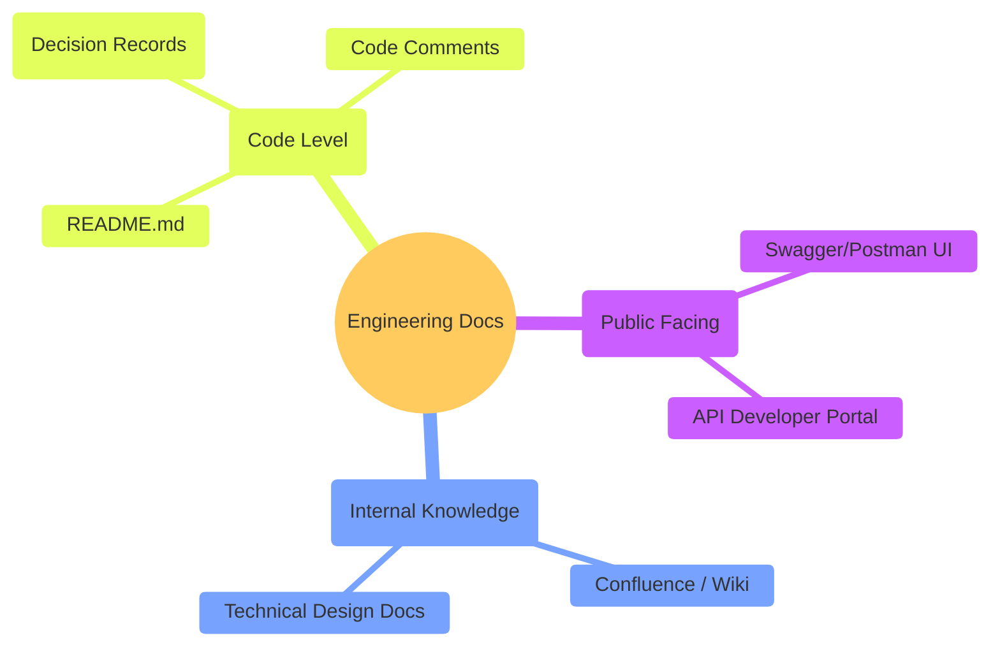
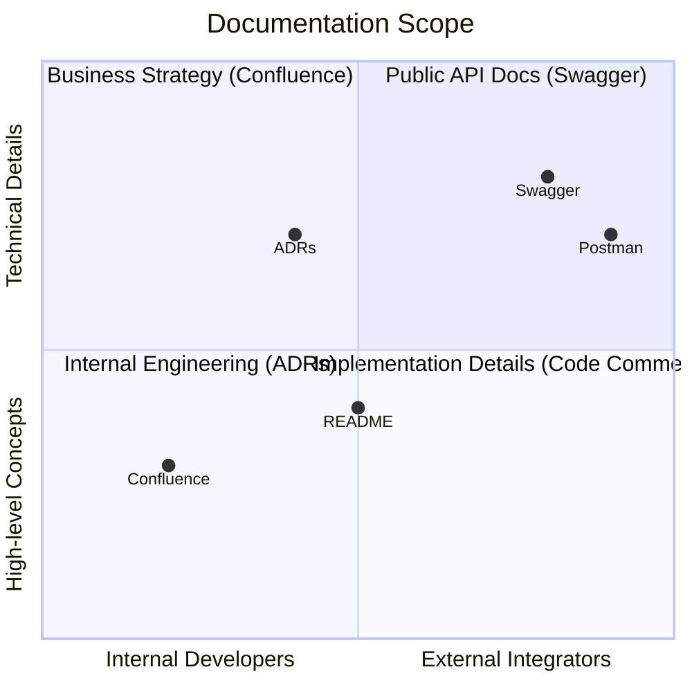

# Extra Lesson: Beyond API Documentation

As a Backend Developer, your job is not just to write code that computers understand, but to write "guides" that humans understand.

While **Swagger** and **Postman** are perfect for explaining _how to use an endpoint_, they don't explain _why_ we built it, _how_ the whole system works, or _what decisions_ we made along the way.

## 🌳 Documentation Tree Structure

Before we dive in, here is how a typical project's documentation is structured:

```text
📁 project-root
├── 📄 README.md                <-- The "Welcome Mat" (Entry point)
├── 📄 DOCUMENTATION_TYPES.md   <-- High-level guides & extra lessons
├── 📁 docs
│   ├── 📁 adrs                 <-- Architecture Decision Records
│   │   ├── 📄 0001-use-postgres.md
│   │   └── 📄 0002-layered-arch.md
│   └── 📁 features             <-- Detailed feature designs
└── 📁 src                      <-- Swagger decorators generate docs from here
```

## The Documentation Hierarchy

In a professional engineering team, we use different "buckets" for different types of knowledge:



---

## 🏛️ Confluence (The Company Library)

**Confluence** (made by Atlassian) is like a private Wikipedia for your company. It is where "Long-form Knowledge" lives.

- **What lives here:** Onboarding guides, holiday policies, high-level system diagrams, and project roadmaps.
- **Analogy:** If your API is a **Recipe**, Confluence is the **History of the Restaurant** and the **Employee Handbook**.
- **When to use it:** When you need to explain a complex business process (e.g., "How our payment refund logic works across 3 different departments").

---

## 📜 ADRs: Architecture Decision Records

Imagine you join a company and ask: _"Why are we using PostgreSQL instead of MongoDB?"_ Usually, the answer is lost in old Slack messages or long-gone developers' heads.

**ADRs** solve this by recording a specific technical choice at a specific point in time.

> [!NOTE]
> **Real Example:** I have created a mock ADR for this project! You can find it here: [0001-use-postgres.md](./docs/adrs/0001-use-postgres.md).

---

## 🏠 README (The Welcome Mat)

Your `README.md` is the first thing a human sees when they open your project folder on GitHub.

- **Purpose:** It should tell them **How to Install**, **How to Run**, and **How to Contribute**.
- **Pro-tip:** If your README is good, a new developer should be able to run your app in under 5 minutes without asking you a single question.

---

## ⚖️ Comparison: Which one do I use?

Here is a visual map of where each documentation type sits in terms of **Target Audience** and **Level of Detail**:



| If you want to...              | Use...                  | Purpose                                     |
| ------------------------------ | ----------------------- | ------------------------------------------- |
| Explain a specific Endpoint    | **Swagger / Postman**   | For Frontend devs to integrate              |
| Explain a Company Process      | **Confluence / Notion** | For anyone in the company to read           |
| Record why you chose a library | **ADR**                 | For future developers to understand history |
| Show how to start the app      | **README.md**           | For developers to get up and running        |

---

## Author

**Alvian Zachry Faturrahman**

- Web: https://alvianzf.id
- LinkedIn: https://linkedin.com/in/alvianzf
