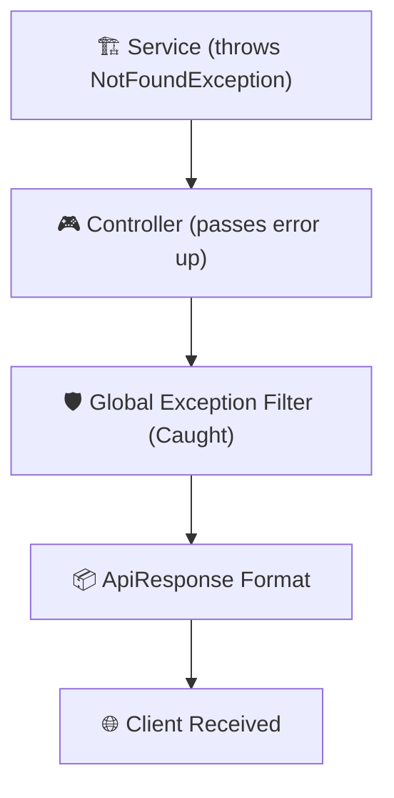
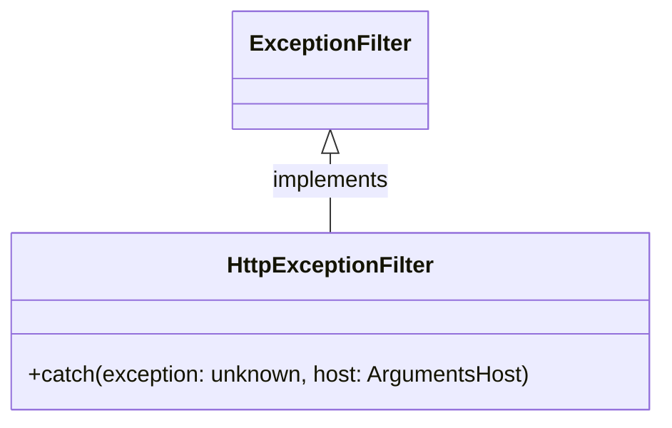
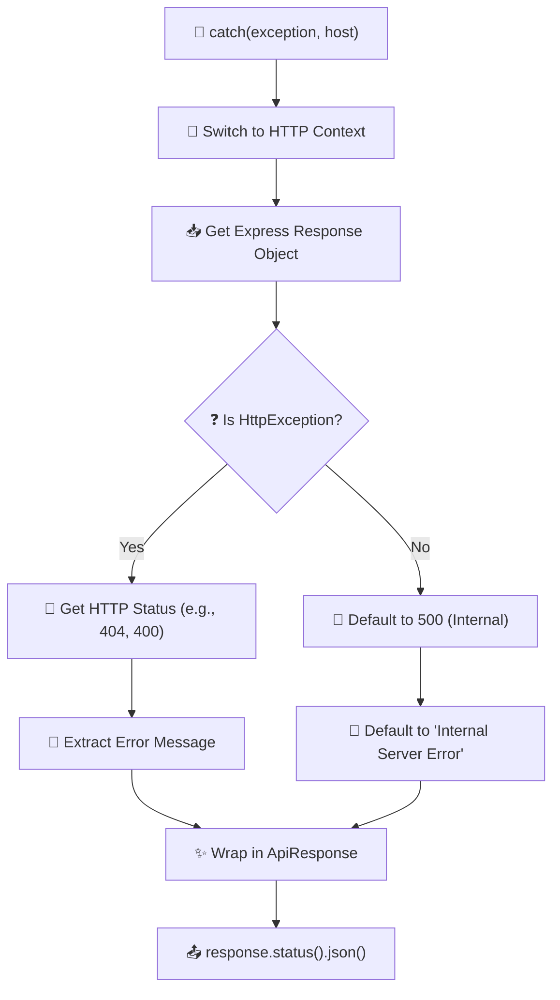

# Additional Lesson: Master Global Error Handling in NestJS

In a production application, delivering consistent error messages is just as important as delivering consistent data. NestJS **Exception Filters** allow you to catch errors across your entire application and format them into a unified structure.

## ❓ Why use Global Exception Filters?

Without a global filter, NestJS returns errors in its default format, which might not match your custom `ApiResponse` structure. This creates friction for frontend developers who have to write different logic for success and error cases.

**Benefits:**
- **Consistency**: Every response (200 or 404) has the same top-level keys (`status`, `message`, `data`).
- **Clean Controllers**: You don't need `try/catch` blocks in every controller. Just throw the error, and the filter handles the rest.
- **Security**: You can catch unexpected 500 errors and hide sensitive stack traces from the user.
- **Improved UX**: Transform complex validation arrays into user-friendly strings.

## 🛠️ The Exception Lifecycle

When a service throws an error, it doesn't just crash. It travels through the NestJS lifecycle until it's caught by a filter.



## 🏗️ Inside the `HttpExceptionFilter`

The `HttpExceptionFilter` is a class that implements the `ExceptionFilter` interface. It has one job: catch an exception and send a clean JSON response.

### 1. The Filter Anatomy



### 2. The Logic Flow



## 📜 Code Breakdown (`src/common/filters/http-exception.filter.ts`)

### Syntax & Function Reference

| Syntax | What is it? | Function |
| :--- | :--- | :--- |
| **`@Catch()`** | Decorator | Marks the class as an exception filter. If empty, it catches ALL exceptions. |
| **`ArgumentsHost`** | Utility Type | Gives access to the underlying request/response objects (Express or Fastify). |
| **`switchToHttp()`** | Method | Specific to HTTP apps, allows us to retrieve the `Request` and `Response`. |
| **`exception instanceof HttpException`** | Logic | Checks if the caught error is a standard NestJS HTTP error. |
| **`status`** | Variable | The numeric code (e.g., 404) that will be returned to the client. |
| **`apiResponse`** | Object | Our custom standardized `{ status, message, data }` structure. |

### How Validation Errors are Handled
When `ValidationPipe` fails, it throws a `BadRequestException` containing an array of messages. Our filter intelligently handles this:

```typescript
// Converts array ['name must be string', 'price must be positive']
// Into a single string: "name must be string, price must be positive"
message: Array.isArray(message) ? message.join(', ') : message
```

## 🌳 File Tree & Integration

```text
📁 src
├── 📁 common
│   └── 📁 filters
│       └── 📄 http-exception.filter.ts  <-- The Filter Logic
├── 📁 types
│   └── 📄 api-response.interface.ts     <-- shared contract
└── 📄 main.ts                           <-- Global Registration
```

### Global Registration in `main.ts`
To activate the filter for every single route in your app, use `app.useGlobalFilters()`:

```typescript
// main.ts
import { HttpExceptionFilter } from './common/filters/http-exception.filter';

async function bootstrap() {
  const app = await NestFactory.create(AppModule);
  
  // Register globally!
  app.useGlobalFilters(new HttpExceptionFilter());
  
  await app.listen(3000);
}
```

---

## ✍️ Author
**Alvian Zachry Faturrahman**
- Web: [alvianzf.id](https://alvianzf.id)
- LinkedIn: [alvianzf](https://linkedin.com/in/alvianzf)
