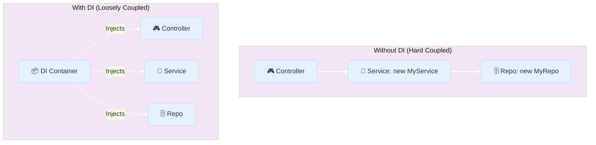
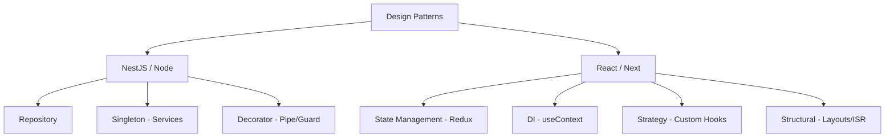

# 🎓 Extra Lesson: Master of Patterns (Full-Stack Edition)

Welcome to this specialized guide! This document is designed to help you not only understand the *how* of design patterns but also the *why*—the knowledge you need to ace your next engineering interview and build scalable apps across the entire stack.

---

## 🌍 Patterns are Universal: Why They Matter

Design patterns aren't just for Backend or Java. They are **solutions to recurring problems** that exist whether you are building a NestJS API, a React component, or a Redux store. 

By identifying these patterns, you can:
- **Build Faster**: You don't reinvent the wheel; you use a proven blueprint.
- **Communicate Better**: Telling a teammate "I'm using the Repository pattern here" conveys 100 lines of intent in 5 words.
- **Scale Easier**: Patterns provide a structure that stays clean even as the codebase grows.

---

## 🏗 1. Dependency Injection (DI) & Inversion of Control (IoC)

### What it is?
**Dependency Injection** is a design pattern where an object receives its dependencies from an external source rather than creating them itself. 
**Inversion of Control** is the broader principle where the framework controls the program flow.

### ⚛️ DI in React: `useContext`
In React, the **`useContext` hook is essentially a DI mechanism**. instead of "Prop Drilling" (passing data through 10 components), you "inject" the data directly from a Provider at the top of the tree.

---

## 🧱 2. Advanced Architectural Patterns

### A. Singleton Pattern
**What it is**: Ensures a class has only one instance.
**NestJS**: Providers are singletons by default.
**Frontend**: A **Redux Store** is the ultimate Singleton. There is only one source of truth for your entire application state.

### B. Repository Pattern
**What it is**: Decouples business logic from raw data access.
**Backend**: `ProductRepository` handles raw array/database calls.
**Frontend**: Creating a `services/` folder in React to handle `fetch`/`axios` calls rather than putting them inside components.

### C. Observer Pattern (Pub-Sub)
**What it is**: Notifying multiple objects about events.
**NestJS**: `EventEmitterModule`.
**Frontend**: **Redux** uses this perfectly. Your UI "subscribes" to the store and "observes" changes to re-render.

---

## ⚡ 3. Framework-Specific Patterns

### ⚛️ ReactJS: Strategy & Decorator Patterns
- **Custom Hooks**: These are a **Strategy Pattern**. You encapsulate a specific logic (strategy) and reuse it across different components.
- **Higher-Order Components (HOCs)**: These follow the **Decorator Pattern**. You wrap a component to add extra functionality (like `withAuth`) without changing the base component.

### 🌐 Next.js: Structural Patterns
- **Layout Pattern**: Using a central `layout.tsx` to wrap pages is a structural pattern that promotes template reusability.
- **File-based Routing**: A pattern that uses the folder structure to define the application's "Discovery Map."

---

## 🎤 4. Interview Preparation: The Cheat Sheet

### Common Interview Questions
1.  **Q: Difference between DI and IoC?**
    *   **A**: IoC is the *concept* (the framework is in charge). DI is the *implementation* (how we pass the tools).
2.  **Q: How do you implement DI in React?**
    *   **A**: Primarily through the **Context API** (`createContext` and `useContext`). It allows "injecting" global state into any branch of the component tree.
3.  **Q: Why use Redux if we have Context?**
    *   **A**: Context is for DI (passing data). **Redux is an architectural pattern** for state management, offering strict rules (Middleware, Reducers, Actions) for scaling complex states.

### Full-Stack Pattern Tree

---

## 💡 Key Advice for Interviews
- **Patterns are "Glue"**: Explain that patterns allow different parts of an app to talk to each other without being "stuck" together (loose coupling).
- **Maintenance**: Always emphasize that we use patterns to make the code **easier for the NEXT developer** to read.

---
**Author**: Antigravity AI
*Part of the Introduction to NestJS Course*
