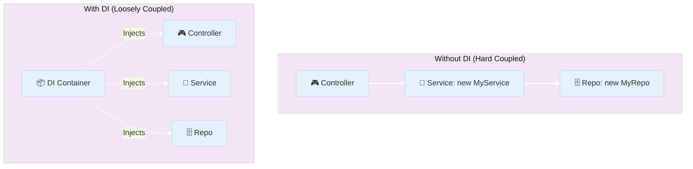
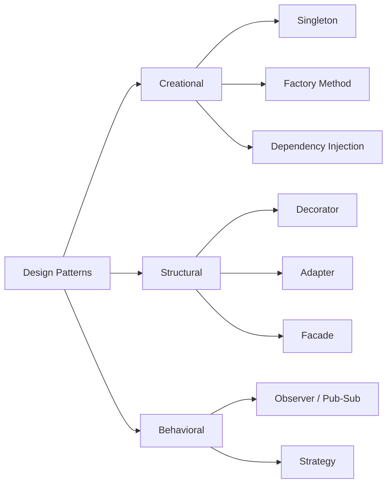

# 🎓 Extra Lesson: Master of Patterns & Dependency Injection

Welcome to this specialized guide! This document is designed to help you not only understand the *how* of NestJS patterns but also the *why*—the knowledge you need to ace your next engineering interview.

---

## 🏗 1. Dependency Injection (DI) & Inversion of Control (IoC)

### What is it?
**Dependency Injection** is a design pattern where an object receives its dependencies from an external source rather than creating them itself. 
**Inversion of Control** is the broader principle where the framework (NestJS) controls the program flow and object creation.



### Pros & Cons
| Feature | Pros | Cons |
| :--- | :--- | :--- |
| **Separation of Concerns** | Classes only focus on their logic, not creation. | Can make the trace of execution harder to follow initially. |
| **Testability** | Easy to swap real dependencies for Mocks/Stubs. | Requires a specialized testing utility (like `Test.createTestingModule`). |
| **Flexibility** | Change implementation in one place (Module) for the whole app. | Adds a small layer of overhead for the DI container. |

---

## 🧱 2. Advanced Architectural Patterns

### A. Singleton Pattern
**What it is**: Ensures a class has only one instance and provides a global point of access.
**In NestJS**: By default, every Provider is a **Singleton**. Nest creates one instance of your Service and shares it everywhere it's injected.

### B. Repository Pattern
**What it is**: A mediator between the domain and data mapping layers.
**Code Example**:
```typescript
@Injectable()
export class ProductRepository {
  // Pure data access logic
  findOne(id: string) { return database.find(id); }
}
```
**Pros**: Decouples business logic from raw database queries. Makes switching from MySQL to MongoDB easy.

### C. Observer Pattern (Pub-Sub)
**What it is**: A subscription mechanism to notify multiple objects about any events that happen to the object they’re observing.
**In NestJS**: Implemented via `EventEmitterModule` or Message Brokers like RabbitMQ/Redis.

---

## 🎤 3. Interview Preparation: The Cheat Sheet

### Common DI Questions
1.  **Q: Difference between DI and IoC?**
    *   **A**: IoC is the *concept* (giving control to the framework). DI is the *implementation* (passing dependencies through constructors).
2.  **Q: What are the different DI Scopes in NestJS?**
    *   **A**: 
        *   **DEFAULT**: Singleton (one instance for the whole app).
        *   **REQUEST**: New instance for every incoming request.
        *   **TRANSIENT**: New instance for every injection point.
3.  **Q: Why use `useValue` vs `useClass`?**
    *   **A**: `useValue` is for external objects/configs. `useClass` is for swapping one service implementation for another.

### Design Pattern Tree


---

## 💡 Key Advice for Interviews
- **Don't just say "it's easier."** Explain it in terms of **maintenance cost**, **test coverage**, and **decoupling**.
- **Mention Mocks**: Explain how DI allows you to mock the database layer to run unit tests in milliseconds without a real database.

---
**Author**: Antigravity AI
*Part of the Introduction to NestJS Course*
