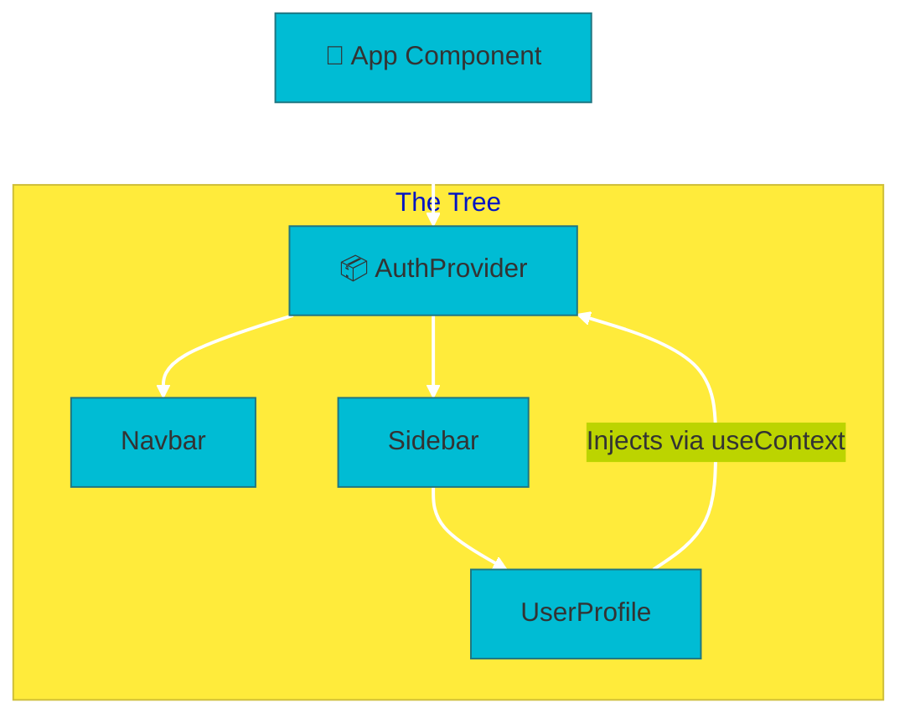
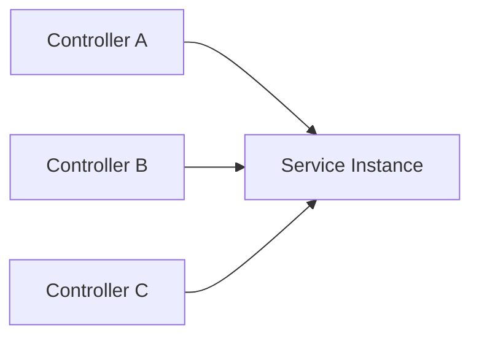
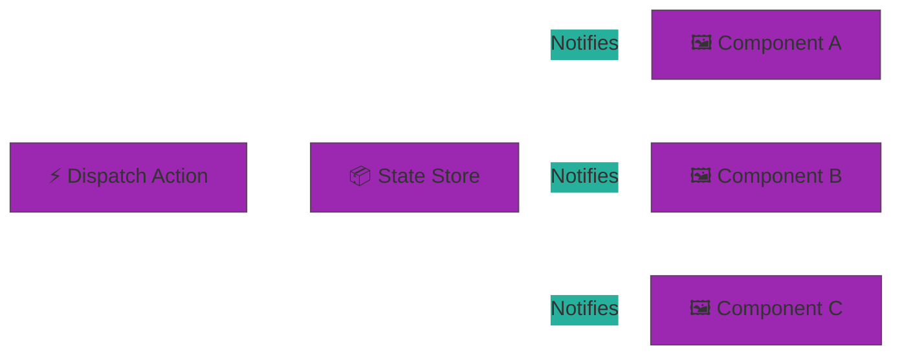
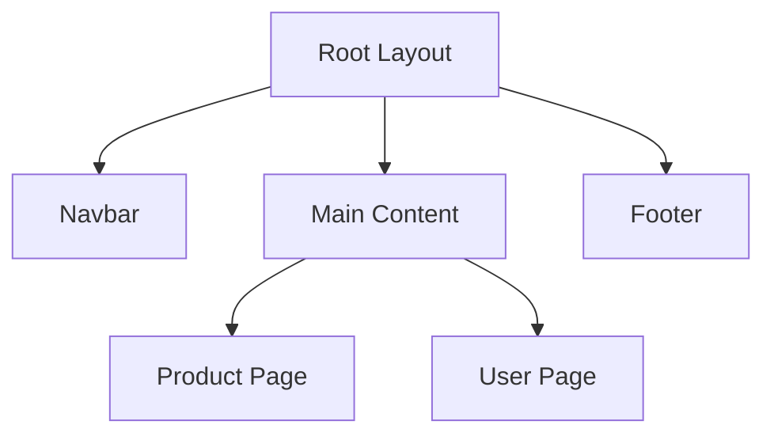

# 🎓 Extra Lesson: Master of Patterns

Welcome to this comprehensive guide! Design patterns aren't just academic concepts; they are the **industrial-strength solutions** that separate "code that works" from "code that survives." This document explores how the same fundamental principles power both your NestJS backend and your React frontend.

---

## 🌍 Why Patterns Matter: The "Why" Before the "How"

Before we look at code, we must understand why we bother with these structures. In a professional environment, patterns are used for three main reasons:

1.  **Maintenance & Velocity**: Patterns provide a common language. If you tell a teammate, "I'm using a Factory here," they immediately understand the architecture WITHOUT reading every line of code.
2.  **Scalability**: Patterns like **Loose Coupling** (via DI) ensure that changing one part of the app (e.g., swapping a database) doesn't require rewriting 50 other files.
3.  **Testability**: Patterns allow you to "mock" parts of the system, enabling you to test complex logic in isolation.

---

## 🏗 1. Dependency Injection (DI) & Inversion of Control (IoC)

### The Deep Dive: "The Hollywood Principle"

The core of IoC is often called the **Hollywood Principle**: _"Don't call us, we'll call you."_

In traditional programming, a class is responsible for creating its own tools (Hard Coupling). In IoC, the class just describes what it needs, and the framework (the "Director") provides those tools at the right moment.

#### ❌ The "Hard Coupled" Way (Bad)

```typescript
class ProductsService {
  private repository = new ProductRepository(); // I'm stuck with this specific implementation!
}
```

#### ✅ The "Injected" Way (Good)

```typescript
class ProductsService {
  constructor(private repository: ProductRepository) {} // I'll work with ANY repository you give me!
}
```

### ⚛️ DI in the Frontend: React Context

React identifies the same problem: "Prop Drilling" (passing data through 10 layers of components). The **Context API** is React's answer to Dependency Injection. This architectural move allows you to "teleport" dependencies across the component tree.



**Code Example (React DI):**

```tsx
const AuthContext = createContext<Auth>(defaultAuth);

// Provider (The DI Container)
export const AuthProvider = ({ children }) => {
  const [user, setUser] = useState(null);
  return (
    <AuthContext.Provider value={{ user, setUser }}>
      {children}
    </AuthContext.Provider>
  );
};

// Injection point
const UserProfile = () => {
  const { user } = useContext(AuthContext); // Injected!
  return <div>{user.name}</div>;
};
```

---

## 🧱 2. Single Source of Truth: The Singleton Pattern

### What it is?

The **Singleton Pattern** ensures that a class has only **one instance** throughout the application lifetime. This avoids memory bloat and ensures that all consumers are looking at the same state.

### 🐘 Backend: NestJS Singletons

In Nest, providers are singletons by default within their module scope.



### ⚛️ Frontend: Redux Store

In Redux, the **Store is a Singleton**. Having multiple stores would make it impossible to track state changes predictably. We want one single place where the entire app's state lives.

**Code Example (Redux Store Singleton):**

```typescript
// store.ts - There is only one instance of this store!
export const store = configureStore({
  reducer: {
    products: productsReducer,
    cart: cartReducer,
  },
});
```

---

## 🗄️ 3. Decoupling the Data: The Repository Pattern

The **Repository Pattern** acts as a mediator between your business logic and your data source. It abstracts away the details of how records are fetched or saved.

### 🏛️ The Full-Stack Logic

| Layer          | Backend (NestJS)     | Frontend (React/Next)                   |
| :------------- | :------------------- | :-------------------------------------- |
| **Component**  | `ProductsController` | `ProductCard.tsx`                       |
| **Logic**      | `ProductsService`    | `useProducts()` Hook                    |
| **Repository** | `ProductsRepository` | `ProductApiClient.ts` (Services folder) |

**Code Example (Frontend "Repository"):**

```typescript
// src/services/ProductRepo.ts
export class ProductRepo {
  static async getAll() {
    const response = await fetch('/api/products');
    return response.json();
  }
}
```

---

## 📊 4. The Watcher: The Observer Pattern

The **Observer Pattern** defines a one-to-many dependency. when the "Subject" (the store) changes, all "Observers" (the components) are notified.

### ⚛️ Observer in action: Redux Subscriptions

Every time you use `useSelector` in React-Redux, you are an **Observer**. You are "watching" the store. When an action is dispatched and the state changes, the Store (the **Subject**) notifies all components (the **Observers**) to re-render.



---

## ⚡ 5. Framework-Level Patterns

### ⚛️ React Strategies: Custom Hooks

Custom hooks are an implementation of the **Strategy Pattern**. You encapsulate a specific "strategy" (logic) and allow components to "plug it in."

```typescript
// The Strategy: useFetch
function useFetch(url: string) {
  const [data, setData] = useState(null);
  const [loading, setLoading] = useState(true);

  useEffect(() => {
    fetch(url)
      .then((res) => res.json())
      .then((json) => {
        setData(json);
        setLoading(false);
      });
  }, [url]);

  return { data, loading };
}
```

### 🌐 Next.js: Structural Patterns

Next.js uses the **Composition Pattern** via layouts. This allows for a nested tree of UI shells.



---

## 🎤 6. Interview Preparation: Pattern Master Class

### 🧠 The Expert Answers

1.  **Q: Why is DI better than global variables?**
    - **A**: Global variables are hidden dependencies. DI makes dependencies **explicit**, improving readability and testability.
2.  **Q: How does the Observer pattern help performance?**
    - **A**: By allowing for **targeted updates**, reducing unnecessary re-renders in large trees.
3.  **Q: When should I NOT use the Repository pattern?**
    - **A**: For simple "CRUD" prototypes where the extra layer adds more friction than value.

---

## ✍️ Author

**Alvian Zachry Faturrahman**

- Web: [alvianzf.id](https://alvianzf.id)
- LinkedIn: [alvianzf](https://linkedin.com/in/alvianzf)
