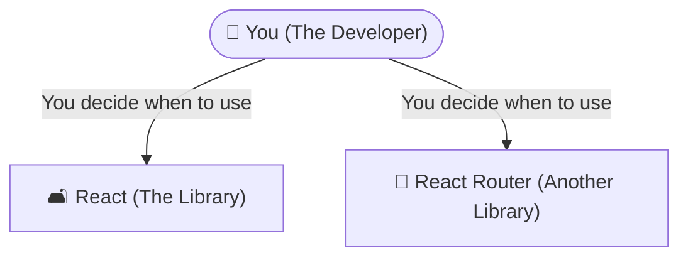
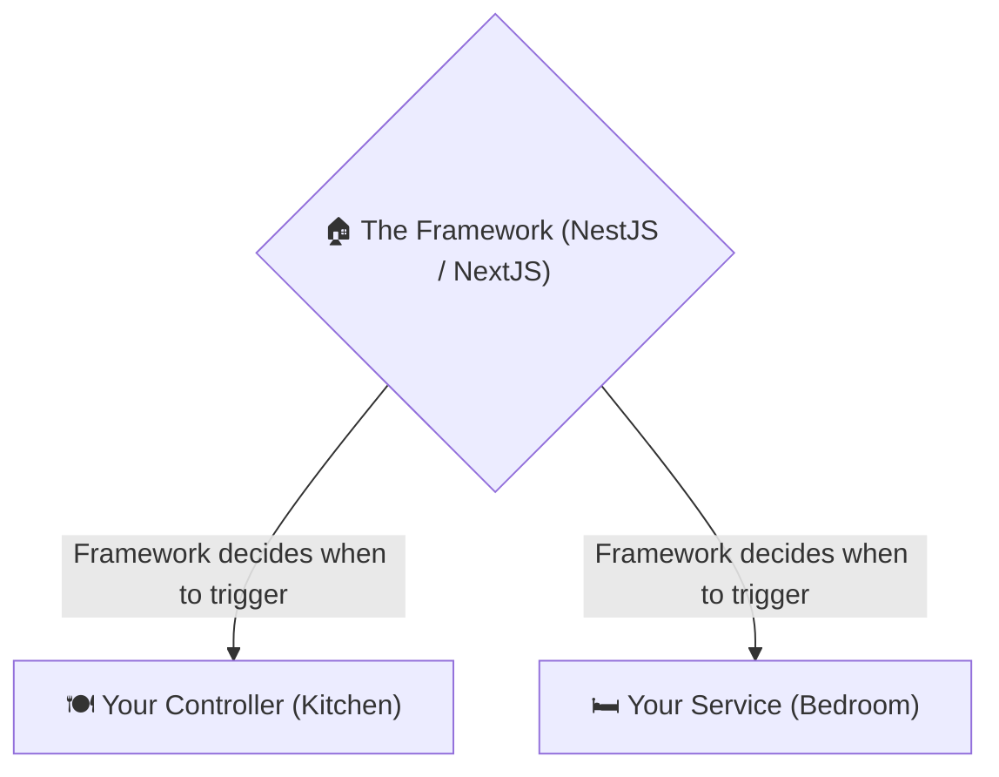
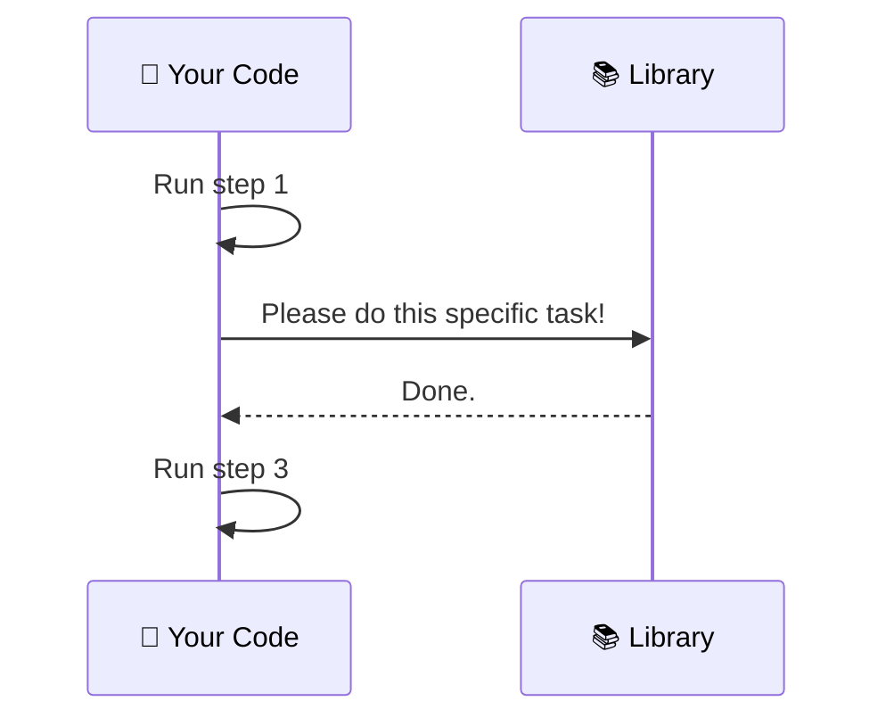
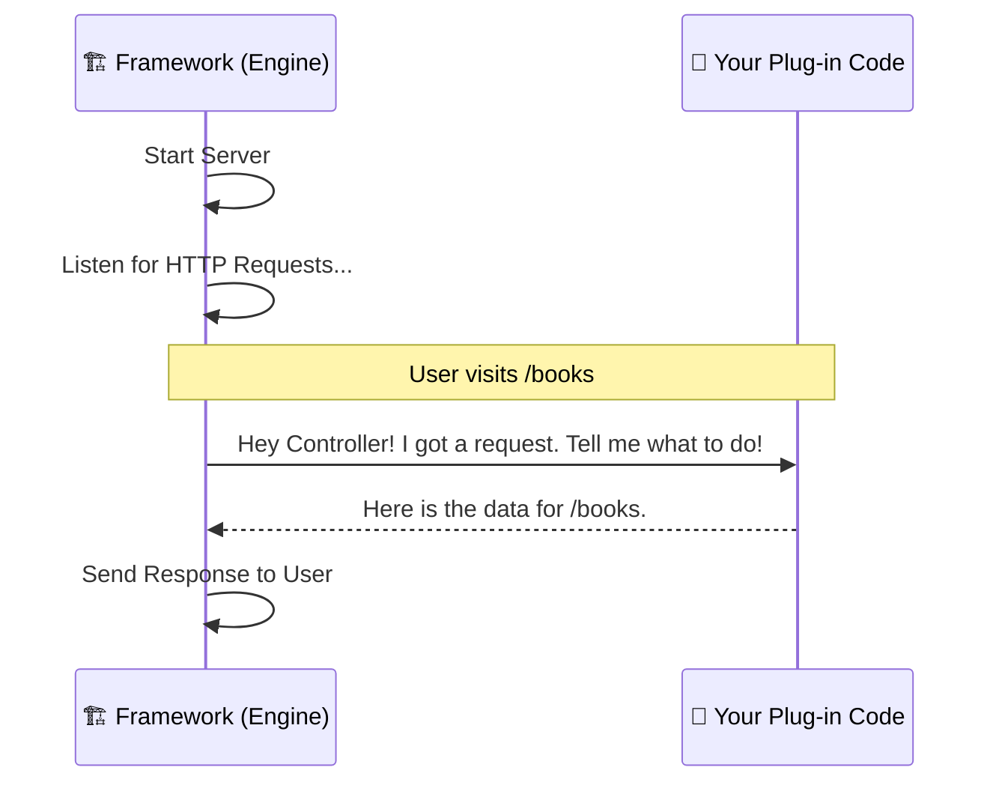

# Module 6 - Extra Content: Library vs Framework

## Topics Covered

- **The Building a House Analogy** 🏠
- **Inversion of Control (IoC)** 🔄
- **Why we use both** 🛠️

## Lecture Notes

### Library vs. Framework: Who is in Charge?

**TL;DR**

- **Library (like React):** A set of tools _you_ use to build your app. **You** are in control.
- **Framework (like NextJS or NestJS):** A pre-built house where _you_ fill in the rooms. **The Framework** is in control.

### Building a House: The Library vs. Framework Approach

Imagine you are tasked with creating a brand new house (which represents building your application).

When you choose to use a **Library**, you are acting as both the architect and the builder.

You go to a warehouse (NPM) and you buy some wood, some nails, and a beautiful pre-packaged IKEA couch (React). You bring the couch back to your empty plot of land.

- **You** decide where the couch goes.
- **You** decide what room it sits in.
- **You** decide if the house even has a living room.
- If you need a toilet, you have to go back to the store and find a "Plumbing Library".

**React is a Library.** It only cares about one thing: painting the UI (the couch). It doesn't care how you route pages (`react-router-dom`), how you fetch data (`axios` or `fetch`), or how you manage state (`Redux` or `Zustand`). It just gives you the tools, and _you call the tools when you need them_.



On the other hand, when you use a **Framework**, you are handed the keys to a house that is already built.

The walls are up, the plumbing is done, and the electricity is wired. However, the rooms are completely empty. Your job is to bring your furniture and put it in the specific rooms the architect designated.

- If you want a bed, it **must** go in the Bedroom.
- If you want a toilet, it **must** go in the Bathroom.
- You can't put the toilet in the Kitchen, because the Framework didn't put plumbing there.

**NextJS and NestJS are Frameworks.** They have very strict rules about where things go:

- In NextJS, pages _must_ go in the `/app` or `/pages` folder, otherwise they won't render.
- In NestJS, business logic _must_ go in a `@Injectable()` Service, and HTTP requests _must_ be caught by a `@Controller()`.

The Framework calls _your_ code when it needs to.



### The Core Concept: "Inversion of Control"

In computer science, this difference is called **Inversion of Control (IoC)** or the "Hollywood Principle" ("Don't call us, we'll call you").

#### 1. Library: You Call It

With a library, your code dictates the flow of the application. You write a script, and right in the middle, you manually call `Library.doSomething()`.



#### 2. Framework: It Calls You

With a framework, the framework dictates the flow. You write small pieces of custom logic and "plug them in" to the framework. The framework is the main engine running 24/7, and it triggers your code when certain events happen (like a user visiting a specific URL).



### Why did we use both?

As a career switcher, you might wonder why we don't just use Frameworks for everything.

#### React (The Library)

- **Extreme Freedom:** You can drop React into a tiny corner of an existing 20-year-old webpage, and it will work perfectly.
- **Lightweight:** It only includes what it needs to render the screen.
- **Drawback:** You have to make 1,000 decisions about folder structures and routing.

#### NextJS & NestJS (The Frameworks)

- **Opinionated:** The creators already made the hard decisions for you. Every NestJS app in the world looks roughly the same, making it easy to jump into a new company's codebase.
- **Batteries Included:** NextJS comes with routing out of the box. NestJS comes with Dependency Injection, Middleware, and strict TypeScript patterns out of the box.
- **Drawback:** You have less freedom. If you try to fight the Framework and put your files in the wrong place, it will break.

### Summary Tree

If we were to look at a NestJS project, the Framework provides the structure (`app.module.ts`, `main.ts`, the decorators), and you just fill in the business logic:

```text
src/
├── main.ts                  # The Framework Engine starts here
├── books/
│   ├── books.controller.ts  # The room where you put HTTP logic
│   ├── books.service.ts     # The room where you put Business logic
│   └── books.module.ts      # Telling the Framework these rooms exist
└── app.module.ts            # The master blueprint of the house
```

**Rule of Thumb:** If you are importing specific functions to help you finish a task, you are using a **Library**. If you are following a strict folder structure and plugging your code into existing rules, you are using a **Framework**.

## Concept Glossary

| Term                         | Definition                                                                                                | Usage                            |
| ---------------------------- | --------------------------------------------------------------------------------------------------------- | -------------------------------- |
| `Library`                    | A collection of pre-written code that you can call upon when needed.                                      | React, Axios, Lodash             |
| `Framework`                  | A foundation that dictates the architecture and calls your code.                                          | NextJS, NestJS, Angular          |
| `Inversion of Control (IoC)` | The principle where the framework dictates the flow of the application, rather than the developer's code. | "Don't call us, we'll call you." |

## Author

**Alvian Zachry Faturrahman**

- Web: https://alvianzf.id
- LinkedIn: https://linkedin.com/in/alvianzf
