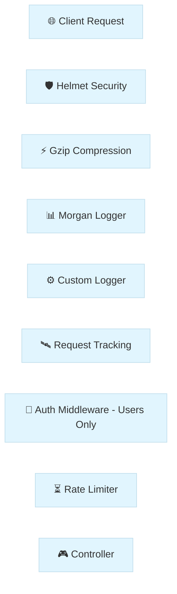

# Module 6: Leveling Up with Middlewares

Welcome to Day 6! Up until now, we've been focused on the "meat" of our application—our Controllers and Services. Today, we're building the "skin" and "nervous system." Think of **Middlewares** as the gatekeepers and watchers that handle the heavy lifting before your code even starts thinking about business logic.

---

## 🏗 Understanding the Flow

Before we write a single line of code, it’s helpful to see how a request actually travels through our system. It’s like a car going through different checkpoints on a highway:



### So, what actually *is* a Middleware?

At its heart, a **Middleware** is just a function. It sits right at the entrance of your server, grabbing the `Request` and `Response` objects as they come in. It can look at them, change them, or even stop them entirely if something looks wrong.

The most important part of any middleware is the `next()` function. It’s the "green light"—if you don't call it, the request just sits there forever, never reaching your controller!

---

## 📜 The Evolution of Our Pipeline

We started today with a simple goal: make our application more observant and secure. Let’s walk through the tools we built and why they matter.

### 1. Starting with the Basics: The Watcher
As your app grows, you'll quickly realize that you need to know exactly what’s hitting your server in real-time. We wanted a "diary" for our app, so we built our **Custom Logger** in `src/common/middleware/logger.middleware.ts`. 

We used a class-based approach because it lets us hook into Nest's powerful "Injectable" system later on. Check it out:
```typescript
@Injectable()
export class LoggerMiddleware implements NestMiddleware {
  use(req: Request, res: Response, next: NextFunction) {
    console.log(`[LOG] ${req.method} ${req.originalUrl} - ${new Date().toISOString()}`);
    next(); // Passing the baton to the next gate!
  }
}
```

To make it active, we registered it in `app.module.ts`. We told Nest to let this "Watcher" shadow every single request (`'*'`). If you run `pnpm run start:dev` and hit any route, you’ll see those logs appearing instantly in your terminal. It’s simple, but it’s our first layer of visibility.

### 2. Adding a Bouncer: API Key Authentication
Logging is great, but transparency only goes so far. Sometimes you need a bouncer. We wanted to protect our `users` data, so we tucked an **Auth Middleware** into `src/common/middleware/auth.middleware.ts`. 

It looks for an `x-api-key` header (we used `introduction-to-nestjs` as our secret password). If the key is missing or wrong? It throws an `UnauthorizedException` and stops the request right then and there. We only applied this to the `users` route in our module configuration because not every request needs a background check.

### 3. Tracking the Journey with UUIDs
Now, imagine you have thousands of users. If one of them hits an error, how do you find *their* specific log in a sea of data? You give every request a unique fingerprint. 

We brought in the industry-standard `uuid` library and built a **Request Tracking** tool. Every time a request hits us, we generate a unique ID, attach it to the request object for our internal use, and even send it back to the user in an `X-Request-ID` header. Now, if a user has an issue, they can give us that ID, and we can find exactly what happened.

---

## 🏭 Calling in the Professionals: Standard Middlewares

While building our own tools is a great way to learn, there are some "heavy hitters" in the Node.js ecosystem that we'd be crazy not to use. They solve common problems so we don't have to.

### 🛡️ Your Shield: Helmet
The web is full of scripts trying to find cracks in your armor. **Helmet** is like a suit of armor for your HTTP headers. By simply adding `app.use(helmet())` in `src/main.ts`, we automatically set specialized headers that protect us from clickjacking, XSS attacks, and more. It’s a "set it and forget it" security win.

### 📊 Your Dashboard: Morgan
While our custom logger is fine for basics, **Morgan** is the professional choice. It gives us beautiful, color-coded summaries in our terminal. We set it up with the `dev` format, so every request now shows us the method, the status code, and exactly how many milliseconds it took to process. No more guessing if a route is slow!

### ⚡ Your Speed Booster: Compression
Big responses take time to travel. **Compression** uses the Gzip algorithm to shrink the data we send back to the user. After adding `app.use(compression())`, your JSON payloads are zipping through the internet much faster, especially for users on mobile or slow connections. You can even see it in action by checking the `Content-Encoding: gzip` header in your browser’s DevTools.

---

## ⏳ Keeping it Fair: Rate Limiting
Finally, we had to think about "bad neighbors"—users or bots who might try to crash our server by sending thousands of requests a second. We integrated `@nestjs/throttler` in our `AppModule` to set a fair limit (10 requests per minute). It’s our way of making sure the server stays healthy for everyone.

---

## 📖 Comprehensive Glossary & Syntax Guide

| Term / Syntax | Function | What is it? |
| :--- | :--- | :--- |
| **Middleware** | **Gatekeeper** | A function called before the route handler, acting as a filter or gate. |
| **`@Injectable()`** | **DI Marker** | Tells Nest that this class can be managed by the Dependency Injection system. |
| **`NestMiddleware`** | **Interface** | A blueprint that ensures your middleware class has the required `use()` method. |
| **`use(req, res, next)`** | **Logic Engine** | The core method where your middleware's logic (logging, auth) lives. |
| **`next()`** | **Pass Control** | A function that must be called to pass the request to the next middleware or handler. |
| **`MiddlewareConsumer`** | **Orchestrator** | A helper object used in `AppModule` to map middlewares to specific routes. |
| **`apply(...mw)`** | **Attachment** | Tells the consumer which middleware(s) you want to register. |
| **`forRoutes('*')`** | **Scoping** | Defines which paths (or controllers) the middleware should watch. |
| **`app.use()`** | **Global Plug** | Used in `main.ts` to register classic "Express-style" middlewares globally. |
| **`ValidationPipe`** | **Cleaner** | Automatically checks incoming data against your DTOs and strips "dirty" fields. |
| **`ThrottlerModule`** | **Traffic Control**| The module responsible for setting up rate limits across your application. |
| **`async / await`** | **Async Logic** | Modern syntax for handling tasks that take time (like database calls) without blocking. |
| **`UUID`** | **Fingerprint** | A universally unique ID used to track a specific request across thousands of logs. |
| **`Gzip`** | **Shrinker** | A compression method that makes data transfer faster across the web. |
| **`XSS`** | **Threat** | Cross-Site Scripting, an attack where malicious scripts are injected into your app. |
| **`TTL`** | **Reset Timer** | Time-To-Live; the duration before a rate-limit counter resets. |

---

## 💡 Key Takeaways
We’ve turned our simple API into a secure, observable, and fast production-grade application today. If you want to see the deeper engineering patterns behind this modular structure, head over to our [Codebase Analysis Guide](./CODEBASE_ANALYSIS.md).

---

## ✍️ Author
**Alvian Zachry Faturrahman**
- Web: [alvianzf.id](https://alvianzf.id)
- LinkedIn: [alvianzf](https://linkedin.com/in/alvianzf)
