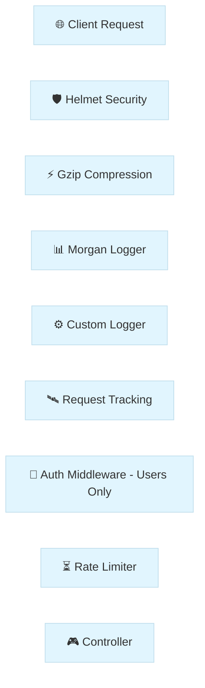
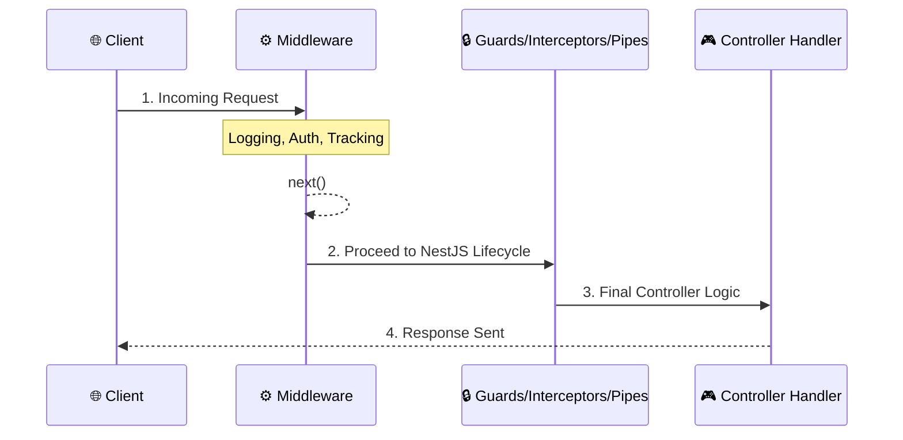
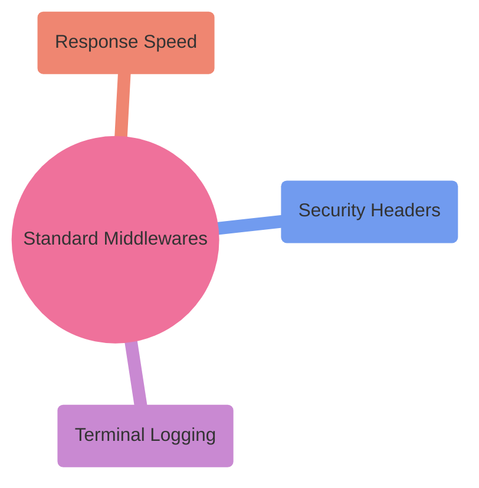

# Module 6: Leveling Up with Middlewares

Welcome to Day 6! Up until now, we've been focused on the "meat" of our application—Controllers and Services. Today, we're building the "skin" and "nervous system." Think of **Middlewares** as the gatekeepers and watchers that handle everything before your code even starts thinking about business logic.

---

## 🏗 Project Architecture & Pipeline

The following diagram shows how a request flows through our application's middleware layer before reaching the Controller:



---

## 🧐 What are Middlewares?

Before we dive into the code, let's talk about the *why*. A **Middleware** is essentially a function that sits between the client's request and your final route handler. In NestJS, they have full access to the `Request` and `Response` objects, and a special `next()` function that passes control to the next part of the system.

### Where does it sit?
Middleware is the **very first thing** that runs after a request hits your server. It sits before any Guards, Interceptors, or Pipes.



### The Three Levels of Scope
Not every middleware needs to watch every request. In NestJS, we can control the "zoom level" or **Scope**:

- **🌍 Global Middlewares**: These watch every single request hitting your app. We usually register these in `main.ts` or `AppModule`.
- **📦 Module Middlewares**: These only guard routes within a specific module (e.g., only protecting the `UsersModule`).
- **🛣️ Route Middlewares**: The most granular level, targeting specific paths (e.g., just `GET /users/profile`).

---

## 📜 The Middleware Journey: Custom Implementations

When we build custom middlewares, we are essentially teaching our application how to "think" about incoming data before it reaches its destination. Let's walk through the custom gates we developed today.

### 1. The Watcher: Custom Logger
**What is it?**
A logger is your application's diary. It records every interaction, helping you see what's happening under the hood in real-time. Without it, you're flying blind!

**How to Implement?**
We built this inside `src/common/middleware/logger.middleware.ts`. Here is how we define a class-based logger that leverages Nest's `Injectable` pattern:

```typescript
@Injectable()
export class LoggerMiddleware implements NestMiddleware {
  use(req: Request, res: Response, next: NextFunction) {
    console.log(`[LOG] ${req.method} ${req.originalUrl} - ${new Date().toISOString()}`);
    next(); // Crucial: This tells Nest to move to the next gate!
  }
}
```

**How to Register?**
We don't want to manually add this to every controller. Instead, we register it in `app.module.ts`:
```typescript
export class AppModule implements NestModule {
  configure(consumer: MiddlewareConsumer) {
    consumer.apply(LoggerMiddleware).forRoutes('*'); // Watch EVERYTHING
  }
}
```

**How to Test Locally?**
1. Run your app: `pnpm run start:dev`.
2. Make any request (e.g., open `http://localhost:3000/api` in your browser).
3. Check your terminal—you should see the `[LOG]` prefix with the request details!

---

### 2. The Bouncer: API Key Authentication
**What is it?**
Think of this as a security guard at the VIP entrance. It checks if the "secret password" (API Key) is present in the request headers before letting anyone see our sensitive user data.

**How to Implement?**
Found in `src/common/middleware/auth.middleware.ts`, it inspects the `x-api-key` header:
```typescript
const apiKey = req.headers['x-api-key'];
if (!apiKey || apiKey !== 'introduction-to-nestjs') {
  throw new UnauthorizedException('Invalid or missing API Key');
}
next();
```

**How to Register?**
We only want this protection for our `users` resource. In `app.module.ts`:
```typescript
consumer.apply(AuthMiddleware).forRoutes('users'); 
```

**How to Test Locally?**
1. Try to GET `http://localhost:3000/users` in Postman/Thunder Client.
2. It should fail with `401 Unauthorized`.
3. Add a header `x-api-key` with the value `introduction-to-nestjs` and try again. Success!

---

### 3. The Tracker: Request UUIDs
**What is it?**
Imagine you have 1,000 users. If one hits an error, how do you find *their* specific logs? We use **Request Tracking** to give every single request a unique "fingerprint" called a UUID.

**How to Install?**
We need a library to generate unique IDs:
```bash
pnpm add uuid
pnpm add -D @types/uuid
```

**How to Implement?**
In `src/common/middleware/request-tracking.middleware.ts`:
```typescript
const requestId = uuidv4();
req['requestId'] = requestId; // Store it for internal use
res.setHeader('X-Request-ID', requestId); // Send it back to the client
next();
```

**How to Test Locally?**
1. Make a request to any endpoint.
2. In the **Response Headers** section of your API client, look for `X-Request-ID`. You'll see a long, unique sequence like `550e8400-e29b-41d4-a716-446655440000`.

---

## 🏭 Production-Grade Guardians: The Heavy Hitters

In the real world, we don't just build our own tools. we use industry-standard libraries that have been battle-tested by millions of developers. 



### 🛡️ Helmet: Your Application's Shield
**What is it?**
The web is full of malicious scripts trying to steal data. **Helmet** automatically sets security-related HTTP headers (like CSP and HSTS) to shield your app from common vulnerabilities like XSS and clickjacking.

**How to Install?**
```bash
pnpm add helmet
```

**How to Implement?**
We register this globally in `src/main.ts`:
```typescript
import helmet from 'helmet';
app.use(helmet());
```

**How to Test Locally?**
1. Run your app and use `curl -I http://localhost:3000/api`.
2. Look for headers like `Strict-Transport-Security` and `X-Content-Type-Options`. If they are there, your shield is active!

---

### 📊 Morgan: The Professional Dashboard
**What is it?**
While our custom logger is great for learning, **Morgan** is the "Go-To" logger for Node.js. It provides beautifully formatted, color-coded logs that tell you exactly how long a request took and its final status.

**How to Install?**
```bash
pnpm add morgan
pnpm add -D @types/morgan
```

**How to Implement?**
In `src/main.ts`:
```typescript
import morgan from 'morgan';
app.use(morgan('dev')); // Use the 'dev' format for clean, colored output
```

**How to Test Locally?**
Observe your terminal when making requests. You'll see professional logs like:
`GET /api 200 12.345 ms - 456`

---

### ⚡ Compression: The Speed Booster
**What is it?**
Big data takes a long time to travel across the internet. **Compression** uses an algorithm called Gzip to shrink your JSON responses before sending them, making your app feel incredibly fast for users on slow connections.

**How to Install?**
```bash
pnpm add compression
pnpm add -D @types/compression
```

**How to Implement?**
In `src/main.ts`:
```typescript
import compression from 'compression';
app.use(compression());
```

**How to Test Locally?**
1. Open your browser's Developer Tools (Network tab).
2. Refresh your app and click on the request.
3. Look for the `Content-Encoding: gzip` header. That means the data was shrunk before arrival!

---

## ⏳ Keeping it Fair: Rate Limiting
**What is it?**
To prevent bots or malicious users from crashing our server with too many requests, we use `@nestjs/throttler`.

**How to Install?**
```bash
pnpm add @nestjs/throttler
```

**How to Implement (`app.module.ts`):**
```typescript
ThrottlerModule.forRoot([{
  ttl: 60000, // Time window (1 minute)
  limit: 10,   // Max requests per window
}]),
```

---

## 📖 Comprehensive Glossary & Syntax Guide

| Term / Syntax | Function | What is it? |
| :--- | :--- | :--- |
| **Middleware** | **Gatekeeper** | A function called before the route handler, acting as a filter or gate. |
| **`@Injectable()`** | **DI Marker** | Tells Nest that this class can be managed by the Dependency Injection system. |
| **`NestMiddleware`** | **Interface** | A blueprint that ensures your middleware class has the required `use()` method. |
| **`use(req, res, next)`** | **Logic Engine** | The core method where your middleware's logic (logging, auth) lives. |
| **`next()`** | **Pass Control** | A function that must be called to pass the request to the next middleware or handler. |
| **`MiddlewareConsumer`** | **Orchestrator** | A helper object used in `AppModule` to map middlewares to specific routes. |
| **`apply(...mw)`** | **Attachment** | Tells the consumer which middleware(s) you want to register. |
| **`forRoutes('*')`** | **Scoping** | Defines which paths (or controllers) the middleware should watch. |
| **`app.use()`** | **Global Plug** | Used in `main.ts` to register classic "Express-style" middlewares globally. |
| **`ValidationPipe`** | **Cleaner** | Automatically checks incoming data against your DTOs and strips "dirty" fields. |
| **`ThrottlerModule`** | **Traffic Control**| The module responsible for setting up rate limits across your application. |
| **`async / await`** | **Async Logic** | Modern syntax for handling tasks that take time (like database calls) without blocking. |
| **`UUID`** | **Fingerprint** | A universally unique ID used to track a specific request across thousands of logs. |
| **`Gzip`** | **Shrinker** | A compression method that makes data transfer faster across the web. |
| **`XSS`** | **Threat** | Cross-Site Scripting, an attack where malicious scripts are injected into your app. |
| **`TTL`** | **Reset Timer** | Time-To-Live; the duration before a rate-limit counter resets. |

---

## 💡 Key Takeaways
We've built a robust, observable, and secure application today. For a deeper dive into *why* these patterns matter in high-end engineering, check our [Codebase Analysis Guide](./CODEBASE_ANALYSIS.md).

---

## ✍️ Author
**Alvian Zachry Faturrahman**
- Web: [alvianzf.id](https://alvianzf.id)
- LinkedIn: [alvianzf](https://linkedin.com/in/alvianzf)
