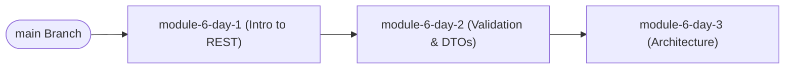
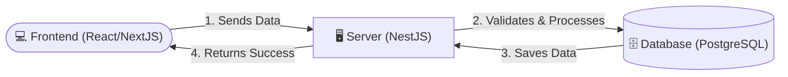

# RevoU: Introduction to NestJS (Module 6)

Welcome to Module 6! This repository contains all the code examples, lecture notes, and extra material you need to learn Backend Development with NestJS.

## Topics Covered

- **How to Use This Repository** 🗺️
- **What is Backend Development?** 🏗️
- **What is NestJS?** 🦁

## Lecture Notes

### 🗺️ How to Use This Repository

This repository is designed to be your interactive textbook.

1. **Branches as Lessons:** Every lesson has its own dedicated branch (e.g., `module-6-day-1`, `module-6-day-2`). You should use them in order as the course progresses.
2. **Read the README:** When you switch to a branch, the `README.md` file will update to show you the specific Lecture Notes for that exact day.
3. **The "Extra Lesson":** On every branch, alongside the README, you will find one "Extra Lesson" markdown file (e.g., `LIBRARY_VS_FRAMEWORK.md`, `ARCHITECTURE_PRINCIPLES.md`). These contain crucial context to help you understand abstract Backend and Engineering concepts. They are written specifically for career switchers and _always_ relate directly to the lesson at hand.
4. **Code is an Example:** The code in this repository serves as a reference. During live sessions, **please pay attention to the instructor**—the live explanation is where the real learning happens!



---

### 🏗️ What is Backend Development?

Since you already know React (Frontend), it helps to know where the Backend fits in.

The **Frontend** is what the user sees and interacts with (buttons, forms, animations).
The **Backend** is what happens behind the scenes. It handles the heavy lifting, security, and permanent memory.



As a Backend Developer, your job is to:

1. Receive requests from the Frontend.
2. Ensure the request is safe and perfectly formatted.
3. Apply "Business Logic" (Rules like: "Can this user afford this item?").
4. Retrieve or save data to the Database.
5. Send the exact right data back to the Frontend.

---

### 🦁 What is NestJS?

**NestJS** is a powerful Backend Framework for Node.js.

Think of it as a pre-built factory. It provides you with a highly organized, strict folder structure so that your code doesn't become a messy pile of spaghetti as your app grows.

Unlike React (which is a Library that lets you do whatever you want), NestJS is a **Framework**. It has strict rules:

```text
src/
├── app.module.ts            # The Engine of the Factory
├── items/
│   ├── items.controller.ts  # The Receptionist (Answers HTTP requests)
│   ├── items.service.ts     # The Worker (Does the actual logic)
│   └── items.repository.ts  # The Vault Manager (Talks to the DB)
```

Because it uses **TypeScript** and **Object-Oriented Programming (OOP)**, it is one of the most popular tools used in enterprise companies today.

## Author

**Alvian Zachry Faturrahman**

- Web: https://alvianzf.id
- LinkedIn: https://linkedin.com/in/alvianzf
