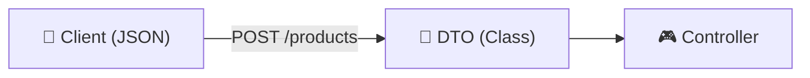

# Module 6, Second Week Day 1: Understanding DTO & Pipes in NestJS

Welcome to Day 5 of the NestJS Introduction! Today we focus on how to handle incoming data safely and efficiently using Data Transfer Objects (DTOs), Pipes, and Mapped Types.

## 📌 Topics covered in this module
- Understanding Data Transfer Objects (DTOs) in NestJS
- Validating request data with `class-validator`
- Enforcing validation using `ValidationPipe`
- Transforming incoming data with built-in pipes
- DTO vs Entity: separating API contracts from database models
- Reusing DTOs with mapped types (`PartialType`, `PickType`, `IntersectionType`)
- Best practices for building scalable DTO structures
- Recap

## 🏗 Project Structure

```text
📁 src
├── 📄 main.ts                <-- Global pipe configuration
├── 📁 data                   <-- Centralized mock data
├── 📁 products               <-- Product Resource
│   ├── 📁 dto                <-- Encapsulated Product DTOs
│   │   ├── 📄 create-product.dto.ts
│   │   └── 📄 update-product.dto.ts
│   ├── 📄 products.controller.ts
│   ├── 📄 products.service.ts
│   └── 📄 products.repository.ts
├── 📁 users                  <-- User Resource
│   ├── 📁 dto                <-- Encapsulated User DTOs
│   │   ├── 📄 create-user.dto.ts
│   │   └── 📄 update-user.dto.ts
│   └── ...
└── 📁 types                  <-- Shared TypeScript Interfaces
```

## 🚀 Learning Goals
- Learn how to define clear and secure data contracts using DTOs.
- Master request validation using `class-validator` and `ValidationPipe`.
- Understand the importance of data transformation in a backend application.
- Explore NestJS mapped types to avoid code duplication in DTOs.

## 📜 Tutorial: Understanding DTO & Pipes

### 1. Understanding Data Transfer Objects (DTOs)
A **DTO** is an object that defines how data will be sent over the network. It serves as a strict contract between the client and the server.



### 2. Validating Request Data with class-validator
We use decorators from the `class-validator` library to define validation rules directly on our DTO properties.

```typescript
// create-product.dto.ts
import { IsString, IsNumber, MinLength, IsPositive } from 'class-validator';

export class CreateProductDto {
  @IsString()
  @MinLength(3)
  name: string;

  @IsNumber()
  @IsPositive()
  price: number;
}
```

### 3. Enforcing Validation using ValidationPipe
To make the decorators work, we must tell NestJS to use the `ValidationPipe` globally in `main.ts`.

```typescript
// main.ts
app.useGlobalPipes(
  new ValidationPipe({
    whitelist: true, // Strips properties not in the DTO
    forbidNonWhitelisted: true, // Throws error if extra properties are sent
    transform: true, // Auto-transforms payloads to DTO instances
  }),
);
```

### 4. Transforming Incoming Data with Built-in Pipes
Pipes can also transform data. For example, converting a string ID from a URL parameter into a number or UUID.

```typescript
@Get(':id')
findOne(@Param('id', ParseIntPipe) id: number) {
  return this.service.findOne(id);
}
```

### 5. DTO vs Entity
| Feature        | DTO (Data Transfer Object)      | Entity (Database Model)         |
| -------------- | ------------------------------- | ------------------------------- |
| **Purpose**    | API Input/Output Contract       | Database Schema Mapping         |
| **Validation** | Format, Length, Presence        | Constraints, Relations, Indexes |
| **Security**   | Hides sensitive internal fields | Contains all database columns   |

### 6. Reusing DTOs with Mapped Types
NestJS provides utility types to help us keep our DTOs DRY:
- **`PartialType`**: Makes all fields optional (perfect for `PATCH`).
- **`PickType`**: Selects only specific fields.
- **`OmitType`**: Removes specific fields (e.g., hiding `password`).

```typescript
// update-product.dto.ts
export class UpdateProductDto extends PartialType(CreateProductDto) {}
```

## 📖 Concept Glossary
- **DTO**: Data Transfer Object, used to define API contracts.
- **Pipe**: A class that can transform or validate data as it passes to an endpoint.
- **Whitelist**: A feature that strips any property from the request body that isn't explicitly defined in the DTO.
- **Mapped Types**: Utility classes used to transform existing DTOs into new ones.

## ✍️ Author
**Alvian Zachry Faturrahman**
- Web: [alvianzf.id](https://alvianzf.id)
- LinkedIn: [alvianzf](https://linkedin.com/in/alvianzf)
