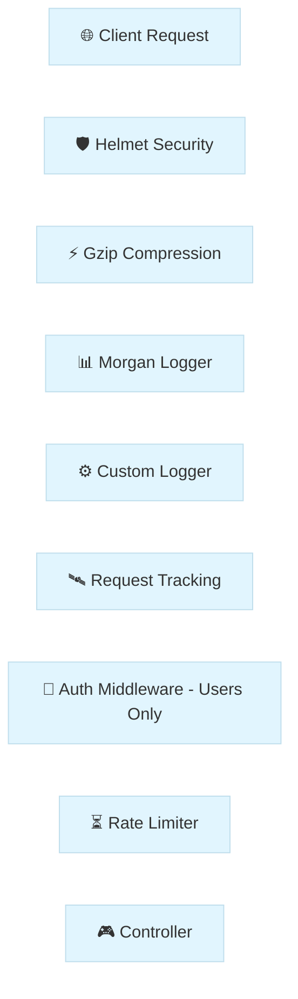

# Module 6: Leveling Up with Middlewares

Welcome to Day 6! Up until now, we've been focused on the "meat" of our application—our Controllers and Services. Today, we're building the "skin" and "nervous system." Think of **Middlewares** as the gatekeepers and watchers that handle the heavy lifting before your code even starts thinking about business logic.

---

## 🏗 Understanding the Flow

Before we write a single line of code, it’s helpful to see how a request actually travels through our system. It’s like a car going through different checkpoints on a highway:



### So, what actually *is* a Middleware?

At its heart, a **Middleware** is just a function. It sits right at the entrance of your server, grabbing the `Request` and `Response` objects as they come in. It can look at them, change them, or even stop them entirely if something looks wrong.

The most important part of any middleware is the `next()` function. It’s the "green light"—if you don't call it, the request just sits there forever, never reaching your controller!

---

## 📜 The Evolution of Our Pipeline

We started today with a simple goal: make our application more observant and secure. Let’s walk through the tools we built and why they matter.

### 1. Starting with the Basics: The Watcher
As your app grows, you'll quickly realize that you need to know exactly what’s hitting your server in real-time. We wanted a "diary" for our app, so we built our **Custom Logger** in `src/common/middleware/logger.middleware.ts`. 

We used a class-based approach because it lets us hook into Nest's powerful "Injectable" system later on. Check it out:
```typescript
@Injectable()
export class LoggerMiddleware implements NestMiddleware {
  use(req: Request, res: Response, next: NextFunction) {
    console.log(`[LOG] ${req.method} ${req.originalUrl} - ${new Date().toISOString()}`);
    next(); // Passing the baton to the next gate!
  }
}
```

To make it active, we registered it in `app.module.ts`. We told Nest to let this "Watcher" shadow every single request (`'*'`) inside the `configure` method:
```typescript
export class AppModule implements NestModule {
  configure(consumer: MiddlewareConsumer) {
    consumer.apply(LoggerMiddleware).forRoutes('*');
  }
}
```
If you want to see it in action, just run `pnpm run start:dev` and hit any route (like `http://localhost:3000/api`). Peek at your terminal—you’ll see those `[LOG]` messages appearing instantly. It’s simple, but it’s our first layer of visibility.

### 2. Adding a Bouncer: API Key Authentication
Logging is great, but transparency only goes so far. Sometimes you need a bouncer. We wanted to protect our `users` data, so we tucked an **Auth Middleware** into `src/common/middleware/auth.middleware.ts`. 

The logic is straightforward: we look for an `x-api-key` header and compare it to our secret:
```typescript
const apiKey = req.headers['x-api-key'];
if (!apiKey || apiKey !== 'introduction-to-nestjs') {
  throw new UnauthorizedException('Invalid or missing API Key');
}
next();
```

We then "hired" this bouncer in `app.module.ts` specifically for the `users` routes:
```typescript
consumer.apply(AuthMiddleware).forRoutes('users'); 
```

You can test this by trying to GET `http://localhost:3000/users` in Postman. You'll get a `401 Unauthorized` until you add the `x-api-key` header with the value `introduction-to-nestjs`.

### 3. Tracking the Journey with UUIDs
Now, imagine you have thousands of users. If one hits an error, how do you find *their* specific log in a sea of data? You give every request a unique fingerprint. 

To do this, we first invited the `uuid` library to the project:
```bash
pnpm add uuid
pnpm add -D @types/uuid
```

Then, in `src/common/middleware/request-tracking.middleware.ts`, we generate a unique ID for every visitor. We attach it to the request for ourselves, and set it in the response header `X-Request-ID` for the client:
```typescript
const requestId = uuidv4();
req['requestId'] = requestId; 
res.setHeader('X-Request-ID', requestId);
next();
```

After registering it in `AppModule`, you can fire any request and check the **Response Headers** in your API client. You'll see that unique sequence—that's the request's permanent fingerprint.

---

## 🏭 Calling in the Professionals: Standard Middlewares

While building our own tools is a great way to learn, there are some "heavy hitters" in the Node.js ecosystem that we'd be crazy not to use. They solve common problems so we don't have to.

### 🛡️ Your Shield: Helmet
The web is full of scripts trying to find cracks in your armor. **Helmet** is like a suit of armor for your HTTP headers. Start by installing the package:
```bash
pnpm add helmet
```

Then, simply add it to your global middleware list in `src/main.ts`:
```typescript
import helmet from 'helmet';
app.use(helmet());
```
It’s a "set it and forget it" security win. You can verify your shield is active by running `curl -I http://localhost:3000/api` and looking for security headers like `Strict-Transport-Security`.

### 📊 Your Dashboard: Morgan
While our custom logger is fine for basics, **Morgan** is the professional choice for clean, color-coded summaries. First, get the library and its types:
```bash
pnpm add morgan
pnpm add -D @types/morgan
```

We set it up in `src/main.ts` using the `dev` format:
```typescript
import morgan from 'morgan';
app.use(morgan('dev')); 
```
Now, every request hit will show the method, status code, and processing time in your terminal. No more guessing why a route feels slow!

### ⚡ Your Speed Booster: Compression
Big responses take time to travel. **Compression** uses the Gzip algorithm to shrink the data we send back. Install it with:
```bash
pnpm add compression
pnpm add -D @types/compression
```

Add it to the pipeline in `src/main.ts`:
```typescript
import compression from 'compression';
app.use(compression());
```
Your JSON payloads are now zipping through the internet much faster. You can confirm this by checking the `Content-Encoding: gzip` header in your browser’s Network tab.

---

## ⏳ Keeping it Fair: Rate Limiting
Finally, we had to think about "bad neighbors"—users or bots who might try to crash our server. We installed the official NestJS throttler:
```bash
pnpm add @nestjs/throttler
```

Then, we integrated it into our `AppModule` to set a fair limit:
```typescript
ThrottlerModule.forRoot([{
  ttl: 60000, // 1 minute window
  limit: 10,   // 10 requests max
}]),
```
It’s our way of making sure the server stays healthy for everyone. Try hitting an endpoint 11 times in a minute, and you'll see our "Bouncer" (Throttler) step in!

---

## 📖 Comprehensive Glossary & Syntax Guide

| Term / Syntax | Function | What is it? |
| :--- | :--- | :--- |
| **Middleware** | **Gatekeeper** | A function called before the route handler, acting as a filter or gate. |
| **`@Injectable()`** | **DI Marker** | Tells Nest that this class can be managed by the Dependency Injection system. |
| **`NestMiddleware`** | **Interface** | A blueprint that ensures your middleware class has the required `use()` method. |
| **`use(req, res, next)`** | **Logic Engine** | The core method where your middleware's logic (logging, auth) lives. |
| **`next()`** | **Pass Control** | A function that must be called to pass the request to the next middleware or handler. |
| **`MiddlewareConsumer`** | **Orchestrator** | A helper object used in `AppModule` to map middlewares to specific routes. |
| **`apply(...mw)`** | **Attachment** | Tells the consumer which middleware(s) you want to register. |
| **`forRoutes('*')`** | **Scoping** | Defines which paths (or controllers) the middleware should watch. |
| **`app.use()`** | **Global Plug** | Used in `main.ts` to register classic "Express-style" middlewares globally. |
| **`ValidationPipe`** | **Cleaner** | Automatically checks incoming data against your DTOs and strips "dirty" fields. |
| **`ThrottlerModule`** | **Traffic Control**| The module responsible for setting up rate limits across your application. |
| **`async / await`** | **Async Logic** | Modern syntax for handling tasks that take time (like database calls) without blocking. |
| **`UUID`** | **Fingerprint** | A universally unique ID used to track a specific request across thousands of logs. |
| **`Gzip`** | **Shrinker** | A compression method that makes data transfer faster across the web. |
| **`XSS`** | **Threat** | Cross-Site Scripting, an attack where malicious scripts are injected into your app. |
| **`TTL`** | **Reset Timer** | Time-To-Live; the duration before a rate-limit counter resets. |

---

## 💡 Key Takeaways
We’ve turned our simple API into a secure, observable, and fast production-grade application today. If you want to see the deeper engineering patterns behind this modular structure, head over to our [Codebase Analysis Guide](./CODEBASE_ANALYSIS.md).

---

## ✍️ Author
**Alvian Zachry Faturrahman**
- Web: [alvianzf.id](https://alvianzf.id)
- LinkedIn: [alvianzf](https://linkedin.com/in/alvianzf)
