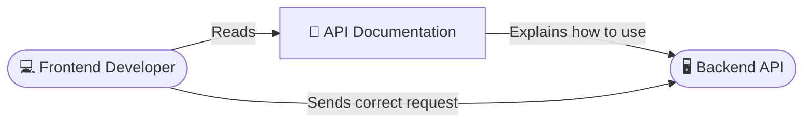

# Module 6 - First Week Day 4

## Topics Covered

- **Importance of API Documentation** 📖
- **Postman for API Documentation** 📬
- **Documenting Endpoints with Decorators** 🎨
- **API Documentation Best Practices** 🏆
- **Creating Postman Collections** �️
- **Sharing Documentation with Team** 🤝
- **Export and Import Collections** 🚀
- **Course Recap** 🎓

## Lecture Notes

### 📖 Importance of API Documentation

API documentation is the instruction manual for your backend.
Without it, Frontend Developers have to guess what data your API expects and what it returns, leading to bugs and frustration.



**Why it matters:**

- **Saves Time:** No more constant messages asking "what does this endpoint return?"
- **Onboarding:** New developers can instantly start working with your API.
- **Contract:** It acts as an agreement between the Frontend and Backend on exactly how data should be formatted.

### 📬 Postman for API Documentation

Postman isn't just for checking if your server works; it's a powerful tool for generating and hosting beautiful API documentation that anyone can read.

1. You create a request in Postman.
2. You save it to a "Collection".
3. Add descriptions and save example responses.
4. Postman automatically generates a web page with code snippets for frontend developers to use.

### 🎨 Documenting Endpoints with Swagger

In NestJS, we can automate our documentation so we never have to write it step-by-step by hand using the **Swagger** module (`@nestjs/swagger`).

#### 1. Setup Swagger in `main.ts`

To enable the beautiful, interactive documentation page, you first "build" the document in your `main.ts` loader file:

```typescript
import { NestFactory } from '@nestjs/core';
import { AppModule } from './app.module';
import { SwaggerModule, DocumentBuilder } from '@nestjs/swagger';

async function bootstrap() {
  const app = await NestFactory.create(AppModule);

  const config = new DocumentBuilder()
    .setTitle('Books API')
    .setDescription('The unofficial Books API description')
    .setVersion('1.0')
    .build();

  const document = SwaggerModule.createDocument(app, config);
  SwaggerModule.setup('api', app, document); // This creates the /api URL page

  await app.listen(3000);
}
bootstrap();
```

Now, if you run your server and visit `http://localhost:3000/api`, you will see your entire API fully documented!

#### 2. Documenting the Controller with Decorators

To add details to that Swagger page, we use **Decorators** right inside our Controllers and DTOs:

```typescript
import { Controller, Get } from '@nestjs/common';
import { ApiTags, ApiOperation, ApiResponse } from '@nestjs/swagger';

@ApiTags('books') // Groups endpoints under "books" in Swagger/Postman
@Controller('books')
export class BooksController {
  @Get()
  @ApiOperation({ summary: 'Get all books' }) // Describes what the endpoint does
  @ApiResponse({ status: 200, description: 'Return all available books.' })
  findAll() {
    return [];
  }
}
```

#### 3. Documenting the DTO

```typescript
import { ApiProperty } from '@nestjs/swagger';

export class CreateBookDto {
  @ApiProperty({
    example: 'Harry Potter',
    description: 'The title of the book',
  })
  title: string;

  @ApiProperty({ example: 300, description: 'Number of pages' })
  pages: number;
}
```

By adding these decorators, NestJS magically generates an "OpenAPI Specification" (a standard JSON format) that Swagger displays on its web page, and that Postman can read and instantly turn into beautiful documentation.

### 🧪 Postman Auto Testing (Scripts)

Postman is not just for Documentation; it is also a powerful **Testing** tool. Instead of manually checking if a request returned `200 OK`, you can write tiny JavaScript "Tests" that run automatically after the request finishes.

In Postman, click on the **Scripts** tab > **Post-response**.

```javascript
// Test 1: Did the server return 200 OK?
pm.test('Status code is 200', function () {
  pm.response.to.have.status(200);
});

// Test 2: Did the server return data fast enough?
pm.test('Response time is under 200ms', function () {
  pm.expect(pm.response.responseTime).to.be.below(200);
});

// Test 3: Did the server actually return the correct Book Title?
pm.test('Book title is correct', function () {
  var jsonData = pm.response.json();
  pm.expect(jsonData.title).to.eql('Harry Potter');
});
```

When you hit "Send", Postman will now show a **Test Results (3/3)** tab declaring if your backend is behaving exactly as it should! This is highly recommended to do before saving your requests to your Collections.

### 🏆 API Documentation Best Practices

1. **Keep it Updated:** Outdated documentation is worse than no documentation.
2. **Provide Examples:** Always include mock JSON request bodies and responses so people know what to expect.
3. **Document Errors:** Explain what a `400 Bad Request` or `404 Not Found` implies for each specific endpoint.
4. **Use Clear Descriptions:** Don't just say "Creates book". Say "Creates a new book and returns the generated Book ID".

### 🗂️ Creating Postman Collections

A **Collection** in Postman is simply a folder structure that holds your API requests together neatly.

```text
📚 My App Collection
├── 📁 Authentication
│   ├── 🔑 POST /login
│   └── 🚪 POST /logout
└── 📁 Books
    ├── 📖 GET /books
    ├── ➕ POST /books
    └── ❌ DELETE /books/:id
```

By organizing your requests into collections and folders, you make it incredibly easy for your team to navigate large APIs.

### 🤝 Sharing Documentation with Team

Once you have a great Postman Collection with saved examples and descriptions, you can share it:

1. **Workspaces:** Invite your team to a Postman Workspace so they can see live updates as you build the API.
2. **Publish Docs:** Use Postman's "Publish" feature to create a public, readable web URL containing your documentation.

### 🚀 Export and Import Collections

If you don't want to use Workspaces, you can physically share your documentation file.

- **Export:** Right-click the Postman Collection -> Export. It gives you a `.json` file containing all your requests and data.
- **Import:** Anyone can click "Import" in their Postman and select that JSON file to instantly get all your requests on their own computer.

---

### 🎓 Course Recap

Congratulations on finishing the first week of Module 6! 🎉

**What we covered:**

1. **Day 1:** Architecture Basics (Frontend vs. Server vs. Database) and REST API principles.
2. **Day 2:** Ensuring bad data doesn't crash our app using **ValidationPipes** and **DTOs** (The Bouncer and the VIP list).
3. **Day 3:** Organizing our factory using **Layered Architecture** (Controllers for HTTP, Services for Logic, Repositories for Data).
4. **Day 4:** Being a good teammate by providing clear **API Documentation** using Postman and NestJS Decorators.

You now have a solid foundation in modern Backend Engineering!

## Concept Glossary

| Term                    | Definition                                             | Usage                                                              |
| ----------------------- | ------------------------------------------------------ | ------------------------------------------------------------------ |
| `API Documentation`     | The instruction manual for an API                      | Read by Frontend Developers to integrate with the Backend          |
| `Swagger UI`            | An interactive web page for your API                   | Automatically generated by NestJS under `/api`                     |
| `Postman auto-scripts`  | JavaScript tests running automatically after a request | Used in Postman's "Scripts" tab to verify data and status codes    |
| `@ApiTags()`            | Swagger Decorator grouping endpoints                   | Organizes controllers in the documentation UI                      |
| `@ApiOperation()`       | Swagger Decorator defining an endpoint                 | Provides a summary/description of what the route does              |
| `@ApiResponse()`        | Swagger Decorator detailing responses                  | Shows expected status codes (e.g., 200 vs 400) and return data     |
| `@ApiProperty()`        | Swagger Decorator for DTO objects                      | Describes exact fields (type, description, example) in the payload |
| `Postman Collection`    | A folder-like structure saving API requests            | Used to neatly organize and share tested endpoints with a team     |
| `OpenAPI Specification` | The standard JSON format describing an API             | Swagger generates this automatically; Postman imports it           |

## Author

**Alvian Zachry Faturrahman**

- Web: https://alvianzf.id
- LinkedIn: https://linkedin.com/in/alvianzf
