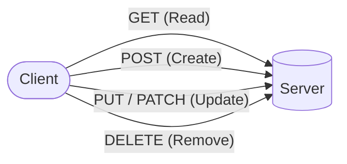
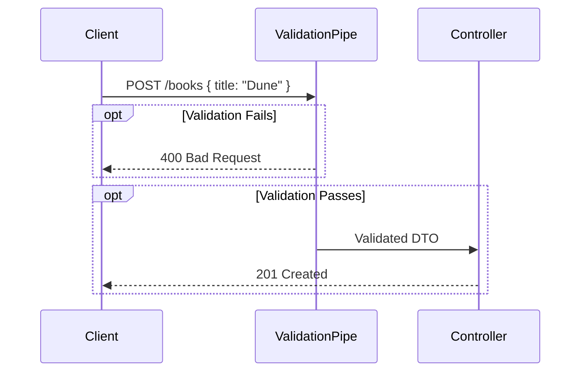

# Module 6 - First Week Day 2

## Topics Covered

- **HTTP Methods**
- **Nest Request and Response Object**
- **Validation Pipes** 🔍
- **DTO with class-validator** ✅
- **BooksController Example** 📚

## Lecture Notes

### HTTP Methods

HTTP methods define the type of action to be performed on a resource:



- **GET**: Retrieve data from a server
- **POST**: Submit data to a server
- **PUT**: Replace an entire resource
- **PATCH**: Partially update a resource
- **DELETE**: Remove a resource

### Nest Request and Response Object

In NestJS, controllers receive `Request` and `Response` objects:

```typescript
import { Controller, Get, Post, Req, Res, Body } from '@nestjs/common';

@Controller('books')
export class BooksController {
  @Get()
  findAll(@Req() request: Request, @Res() response: Response) {
    console.log({ request });
    console.log({ response });

    return {
      message: 'List of all books',
      data: books,
    };
  }
}
```

### Validation Pipes

Pipes transform and validate incoming data. NestJS provides the `ValidationPipe` to automatically validate request payloads against DTO classes:

```typescript
import { ValidationPipe } from '@nestjs/common';

app.useGlobalPipes(new ValidationPipe());
```

The `ValidationPipe`:

- Validates incoming data against DTO class definitions
- Automatically strips properties not defined in the DTO
- Throws `BadRequestException` on validation failure
- Can be applied globally or per-route



### DTO with class-validator

**Data Transfer Objects (DTOs)** define the shape and validation rules for data exchanged between client and server.

#### How DTOs Function

DTOs validate incoming data by decorating class properties with validation rules. When `ValidationPipe` processes a request, it:

1. Transforms the plain request body into a DTO class instance
2. Validates properties against their decorators
3. Returns errors if validation fails

#### Installation

```bash
pnpm install class-validator class-transformer
```

- **class-validator**: Provides validation decorators (@IsString, @IsEmail, etc.)
- **class-transformer**: Converts plain objects to typed class instances

#### Where to Put DTOs

Create DTOs in a dedicated `dto` folder within your module:

```text
src/
└── books/
    ├── dto/
    │   ├── create-book.dto.ts
    │   └── update-book.dto.ts
    ├── books.controller.ts
    └── books.service.ts
```

#### Rules for Using DTOs

1. **One DTO per operation**: Separate `CreateBooksDto` from `UpdateBooksDto`
2. **Import decorators from class-validator**: Use provided decorators for validation
3. **Type properties explicitly**: Always define property types (string, number, etc.)
4. **Use @Optional() for nullable fields**: Only if the field isn't required
5. **Apply ValidationPipe globally or per-controller**: Ensure validation runs on all requests

#### DTO Examples

```typescript
import {
  IsString,
  IsNumber,
  IsBoolean,
  IsDateString,
  IsOptional,
  IsEmail,
  MinLength,
} from 'class-validator';

export class CreateBooksDto {
  @IsString()
  title: string;

  @IsString()
  author: string;

  @IsNumber()
  pages: number;

  @IsOptional()
  @IsBoolean()
  isAvailable: boolean = true;

  @IsDateString()
  publishedDate: Date;
}

export class CreateUserDto {
  @IsString()
  name: string;

  @IsEmail()
  email: string;

  @MinLength(8)
  password: string;
}
```

#### Using DTOs in Controllers

```typescript
@Post()
create(@Body() bodyData: CreateBooksDto) {
  books.push(bodyData);
  return {
    message: 'Book created',
    data: bodyData,
  };
}
```

## Syntax Glossary

| Term                   | Definition                                                        | Usage                                   |
| ---------------------- | ----------------------------------------------------------------- | --------------------------------------- |
| `@Controller('books')` | Decorator defining the base route for all endpoints in this class | Routes all requests to /books           |
| `@Get()`               | Decorator mapping HTTP GET requests                               | Retrieves data without modifying it     |
| `@Get(':id')`          | Decorator mapping GET requests with a route parameter             | :id is a placeholder for dynamic values |
| `@Post()`              | Decorator mapping HTTP POST requests                              | Creates new resources                   |
| `@Put(':id')`          | Decorator mapping HTTP PUT requests                               | Updates entire existing resources       |
| `@Delete(':id')`       | Decorator mapping HTTP DELETE requests                            | Removes existing resources              |
| `@Param('id')`         | Decorator extracting URL parameters                               | Captures :id from route path            |
| `@Body()`              | Decorator extracting JSON request body                            | Accesses data sent by the client        |
| `@Req()`               | Injects the request object                                        | Method parameter                        |
| `@Res()`               | Injects the response object                                       | Method parameter                        |
| `@IsString()`          | Validates string type                                             | Property decorator                      |
| `@IsNumber()`          | Validates number type                                             | Property decorator                      |
| `@IsBoolean()`         | Validates boolean type                                            | Property decorator                      |
| `@IsDateString()`      | Validates date string format                                      | Property decorator                      |
| `@IsEmail()`           | Validates email format                                            | Property decorator                      |
| `@IsOptional()`        | Makes field optional                                              | Property decorator                      |
| `@MinLength()`         | Validates minimum length                                          | Property decorator                      |
| `type Book`            | TypeScript type alias                                             | Defines the shape of a book object      |
| `books.find()`         | Array method searching for first matching element                 | Retrieves a single book by condition    |
| `books.splice()`       | Array method removing elements                                    | Deletes an item at a specific index     |
| `ValidationPipe`       | Validates incoming data against DTOs                              | Global or per-route                     |
| `class-validator`      | Data validation decorators library                                | Installation dependency                 |
| `class-transformer`    | Object transformation library                                     | Installation dependency                 |

## Author

**Alvian Zachry Faturrahman**

- Web: https://alvianzf.id
- LinkedIn: https://linkedin.com/in/alvianzf
