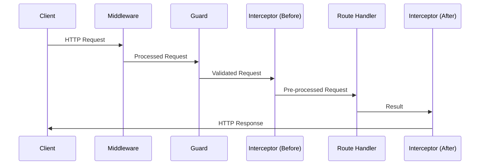

# Module 6 - First Week Day 3

## Topics Covered

- **Review of CRUD Operations**
- **Layered Architecture & N-Tier**
- **Type Definitions & Domain Models**
- **Service Layer Implementation**
- **Repository Pattern**
- **Implementing Complete CRUD API**
- **Custom Business Logic**
- **Request Lifecycle in NestJS** 🔄

## Lecture Notes

### Review of CRUD Operations

CRUD operations form the foundation of most applications:

- **Create (POST)**: Add new resources to the database
- **Read (GET)**: Retrieve existing resources
- **Update (PUT/PATCH)**: Modify existing resources
- **Delete (DELETE)**: Remove resources

Each operation maps to a specific HTTP method and database action.

### Layered Architecture (N-Tier Architecture)

To keep our application organized as it grows, NestJS encourages a **Layered Architecture** (often referred to as **N-Tier Architecture**, commonly implemented as a 3-tier architecture).

In this structure, the application is divided into specific layers, each with a distinct responsibility:

1. **Presentation Layer (Controllers):** Handles incoming HTTP requests, validates input, and sends HTTP responses. It doesn't contain complex logic.
2. **Business/Service Layer (Services):** Contains the core business logic, calculations, and rules. It takes requests from the controller, processes them, and returns the result.
3. **Data Access Layer (Repositories):** Responsible for directly interacting with the database or storage system.

```mermaid
flowchart LR
    Client([Client]) --> Controller[Controller<br>(Presentation)]
    Controller --> Service[Service<br>(Business Logic)]
    Service --> Repository[Repository<br>(Data Access)]
    Repository --> Database[(Database)]
```

**Why separate into layers?**

- **Separation of Concerns (SoC):** Each part of your code has one specific job. Controllers don't write SQL, and repositories don't handle HTTP headers.
- **Maintainability & Scalability:** You can easily find where to fix a bug or add a feature. If you want to change databases, you only touch the Data Access layer. If you want to add GraphQL alongside your REST API, you just add new Controllers/Resolvers without touching the Service logic.
- **Testability:** You can test business logic in isolation by mocking the data access layer, leading to faster and more reliable unit tests.

### Type Definitions & Domain Models

Before building our services and repositories, it is best practice to define our domain models (types and interfaces) in a dedicated location, such as `src/types/book.type.ts`.

```text
src/
├── types/
│   └── book.type.ts       # Shared Domain Model
├── books/
│   ├── books.controller.ts
│   ├── books.service.ts
│   └── books.repository.ts
```

Why separate types into their own folder?

- **Single Source of Truth:** Establishes a single place for our domain models.
- **Prevents Duplication:** We avoid redefining the `Book` type in our Controller, Service, and Repository.
- **Clean Architecture:** It allows the type to be cleanly imported across different layers without tightly coupling those layers to a specific implementation file.

### Service Layer Implementation

Services contain business logic and are injected into controllers. They handle data processing, database interactions, and complex operations:

```typescript
import { Injectable } from '@nestjs/common';

@Injectable()
export class BooksService {
  private books = [];

  create(createBookDto) {
    const newBook = { id: Date.now(), ...createBookDto };
    this.books.push(newBook);
    return newBook;
  }

  findAll() {
    return this.books;
  }

  findOne(id: number) {
    return this.books.find((book) => book.id === id);
  }

  update(id: number, updateBookDto) {
    const book = this.findOne(id);
    if (book) Object.assign(book, updateBookDto);
    return book;
  }

  delete(id: number) {
    this.books = this.books.filter((book) => book.id !== id);
    return { message: 'Book deleted' };
  }
}
```

### Repository Pattern

The Repository Pattern abstracts data access logic, making code more testable and maintainable.

#### What it is and how it works

A repository sits between your service logic and the database. Instead of a service directly querying the database (or in our case, an array), it calls methods on the repository. The repository translates these calls into the specific operations needed for the chosen storage mechanism. This provides a unified, object-oriented interface for data access.

#### Why it is good

- **Separation of Concerns:** Services only care about _what_ data to get or save, not _how_ to get or save it.
- **Testability:** You can easily mock repositories in unit tests without needing a real database connection.
- **Maintainability:** If you switch from PostgreSQL to MongoDB (or an array to a real DB), you only need to update the repository methods; your service logic remains untouched.
- **Centralized Data Logic:** Prevents duplicate queries across multiple services.

> **Note on Mock Data:** Even when using a Repository, we often extract hardcoded mock data (like a pre-populated books array) into a separate file (e.g., `src/books/data/books.mock.ts`). We do this because we haven't connected a real database yet. Isolating this mock data keeps the repository logic clean, focused only on operations, and closely mimics how we would later import a database client to make a call. It makes the future transition to a real database much smoother.

```typescript
import { Injectable } from '@nestjs/common';

@Injectable()
export class BooksRepository {
  private books = [];

  save(book) {
    this.books.push(book);
    return book;
  }

  findAll() {
    return this.books;
  }

  findById(id: number) {
    return this.books.find((book) => book.id === id);
  }

  update(id: number, book) {
    const index = this.books.findIndex((b) => b.id === id);
    if (index !== -1) this.books[index] = { ...this.books[index], ...book };
    return this.books[index];
  }

  delete(id: number) {
    this.books = this.books.filter((book) => book.id !== id);
  }
}
```

#### Alternatives to the Repository Pattern

Depending on the size and complexity of the project, you might consider other patterns:

- **Active Record:** Models directly contain the methods to interact with the database (e.g., `Book.save()`, `Book.find()`). Good for simpler schemas but can lead to bloated models. (Often used tightly with ORMs like TypeORM or Sequelize).
- **Data Access Object (DAO):** Similar to repositories but usually mapped closer to the specific tables and low-level queries rather than high-level domain entities.
- **Direct ORM usage in Services:** For very small microservices or rapid prototyping, injecting the ORM directly into the service might be faster, though it sacrifices the clean separation.

### Implementing Complete CRUD API

Integrate the service into a controller to expose CRUD endpoints:

```typescript
import {
  Controller,
  Get,
  Post,
  Put,
  Delete,
  Body,
  Param,
} from '@nestjs/common';
import { BooksService } from './books.service';
import { CreateBooksDto } from './dto/create-books.dto';
import { UpdateBooksDto } from './dto/update-books.dto';

@Controller('books')
export class BooksController {
  constructor(private readonly booksService: BooksService) {}

  @Post()
  create(@Body() createBookDto: CreateBooksDto) {
    return this.booksService.create(createBookDto);
  }

  @Get()
  findAll() {
    return this.booksService.findAll();
  }

  @Get(':id')
  findOne(@Param('id') id: string) {
    return this.booksService.findOne(+id);
  }

  @Put(':id')
  update(@Param('id') id: string, @Body() updateBookDto: UpdateBooksDto) {
    return this.booksService.update(+id, updateBookDto);
  }

  @Delete(':id')
  delete(@Param('id') id: string) {
    return this.booksService.delete(+id);
  }
}
```

### Custom Business Logic

Add domain-specific logic to services for filtering, calculations, or validations:

```typescript
@Injectable()
export class BooksService {
  // ... existing methods

  findByAuthor(author: string) {
    return this.books.filter(
      (book) => book.author.toLowerCase() === author.toLowerCase(),
    );
  }

  getAvailableBooks() {
    return this.books.filter((book) => book.isAvailable);
  }

  borrowBook(id: number) {
    const book = this.findOne(id);
    if (!book?.isAvailable) throw new Error('Book not available');
    book.isAvailable = false;
    return book;
  }
}
```

### Request Lifecycle in NestJS

Understanding the request flow helps optimize and debug applications:

1. **Request arrives** → HTTP request sent to the application
2. **Middleware executes** → Global or route-specific middleware processes the request
3. **Guards execute** → Authentication/authorization checks occur
4. **Interceptors (before)** → Pre-processing logic before controller method
5. **Controller method** → Route handler executes
6. **Service layer** → Business logic and data operations
7. **Interceptors (after)** → Post-processing logic after controller method
8. **Response sent** → Response returned to the client



## Syntax Glossary

| Term                                    | Definition                                                       | Usage                                    |
| --------------------------------------- | ---------------------------------------------------------------- | ---------------------------------------- |
| `@Injectable()`                         | Decorator marking a class as a provider for dependency injection | Services, repositories                   |
| `constructor(private service: Service)` | Dependency injection via constructor                             | Injects services into controllers        |
| `@Param('id')`                          | Extracts URL route parameters                                    | Captures dynamic values from path        |
| `+id`                                   | Type coercion operator                                           | Converts string parameter to number      |
| `find()`                                | Array method returning first match                               | Retrieves single item by condition       |
| `filter()`                              | Array method returning filtered array                            | Retrieves multiple items by condition    |
| `Repository Pattern`                    | Data access abstraction layer                                    | Separates data logic from business logic |
| `Service Layer`                         | Business logic container                                         | Handles CRUD and custom operations       |
| `Object.assign()`                       | Merges object properties                                         | Updates object with new values           |
| `Middleware`                            | Processes requests before controllers                            | Logging, authentication setup            |
| `Guards`                                | Authorization checks before handlers                             | Permission validation                    |
| `Interceptors`                          | Pre/post-processing hooks                                        | Logging, error handling, transformation  |
| `Request Lifecycle`                     | Path from request to response                                    | Understanding NestJS execution order     |

## Author

**Alvian Zachry Faturrahman**

- Web: https://alvianzf.id
- LinkedIn: https://linkedin.com/in/alvianzf
