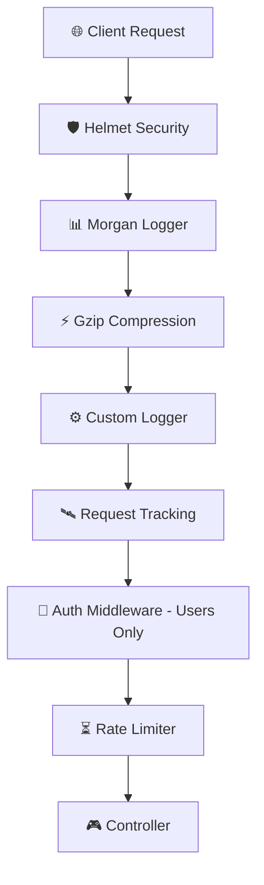

# Module 6: Leveling Up with Middlewares

Welcome to Day 6! Up until now, we've been focused on the "meat" of our application—Controllers and Services. Today, we're building the "skin" and "nervous system." Think of **Middlewares** as the gatekeepers and watchers that handle everything before your code even starts thinking about business logic.

---

## 🏗 Project Architecture & Pipeline

The following diagram shows how a request flows through our application's middleware layer before reaching the Controller:



### 📂 File Structure
```text
📁 src
├── 📁 common
│   └── 📁 middleware
│       ├── 📄 logger.middleware.ts
│       ├── 📄 auth.middleware.ts
│       └── 📄 request-tracking.middleware.ts
└── 📄 main.ts (Global Config)
└── 📄 app.module.ts (Module Config)
```

---

## 📜 The Middleware Journey

### 1. Observability with Custom Loggers
In professional apps, if you don't log it, it didn't happen. We built a **Logger Middleware** that acts as the application's "eyes".

**Implementation (`src/common/middleware/logger.middleware.ts`):**
```typescript
@Injectable()
export class LoggerMiddleware implements NestMiddleware {
  use(req: Request, res: Response, next: NextFunction) {
    console.log(`[LOG] ${req.method} ${req.originalUrl}`);
    next();
  }
}
```

**Registration**: Registered globally in `app.module.ts` using `.forRoutes('*')`.

### 2. Guarding the Gates: Custom Auth
We protected the `/users` resource using a custom **AuthMiddleware**. It acts as a bouncer, checking for a specific API Key.

**The Logic:**
- **Header**: `x-api-key`
- **Secret**: `introduction-to-nestjs`
- **Action**: Throws `UnauthorizedException` if incorrect.

**Registration**:
```typescript
// src/app.module.ts
consumer.apply(AuthMiddleware).forRoutes('users');
```

---

## 🏭 Production-Grade Guardians

We've integrated three heavy-hitters to make our app secure and fast.

| Tool | Benefit | Installation | Registration |
| :--- | :--- | :--- | :--- |
| **Helmet** | Security Shield | `pnpm add helmet` | `app.use(helmet())` |
| **Morgan** | Pro Logging | `pnpm add morgan` | `app.use(morgan('dev'))` |
| **Compression** | Gzip Speed | `pnpm add compression` | `app.use(compression())` |

---

## 🛰️ Advanced: Tracing & Throttling

### The Invisible String: Request Tracking
Every request now gets a unique UUID via our `RequestTrackingMiddleware`.
1. **Generate**: Using `uuid` v4.
2. **Attach**: Added to the `Request` object.
3. **Return**: Sent back in `X-Request-ID` header.

### Keeping it Fair: Rate Limiting
We use `@nestjs/throttler` to prevent abuse.
- **Limit**: 10 requests per minute.
- **Effect**: Returns `429 Too Many Requests` when exceeded.

---

## 📖 Glossary of Terms

| Term | Definition |
| :--- | :--- |
| **Middleware** | A function called before the route handler, with access to `req` and `res`. |
| **Gzip** | A file format and software application used for file compression and decompression. |
| **XSS** | Cross-Site Scripting, a vulnerability where attackers inject malicious scripts. |
| **TTL** | Time-To-Live, the time a record/session is kept before expiring. |
| **UUID** | Universally Unique Identifier, a 128-bit number used to uniquely identify info. |

---

## 💡 Key Takeaways & Extra Lessons
Check out the [Codebase Analysis Guide](./CODEBASE_ANALYSIS.md) for a deep-dive into why we choice these patterns!

---

## ✍️ Author
**Alvian Zachry Faturrahman**
- Web: [alvianzf.id](https://alvianzf.id)
- LinkedIn: [alvianzf](https://linkedin.com/in/alvianzf)
