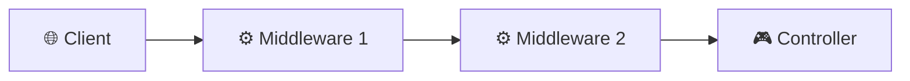

# Module 6, Second Week Day 2: Middlewares in NestJS

Welcome to Day 6! Today we dive into **Middlewares**, a powerful way to intercept and process requests before they reach your route handlers. We'll cover everything from custom implementations to industry-standard security and performance middleware.

## 📌 Topics covered in this module
- Understanding NestJS Middlewares
- Function-based vs Class-based Middlewares
- Global, Module, and Route-level Scopes
- Custom Authentication Middleware
- Security with Helmet & Rate Limiting
- Performance with Compression
- Request Tracking with Unique IDs

## 🏗 Project Structure (Updated)

```text
📁 src
├── 📁 common
│   ├── 📁 filters
│   │   └── 📄 http-exception.filter.ts
│   └── 📁 middleware             <-- New: Centralized Middlewares
│       ├── 📄 logger.middleware.ts
│       ├── 📄 auth.middleware.ts
│       └── 📄 request-tracking.middleware.ts
└── 📄 main.ts                    <-- Global Middleware registration
```

## 🚀 Learning Goals
- Understand the Middleware lifecycle in the NestJS pipeline.
- Implement both functional and class-based middlewares.
- Secure specific module routes with custom authentication logic.
- Integrate production-grade middleware (Morgan, Helmet, Compression).
- Master advanced request tracking and rate limiting.

---

## 📜 Tutorial: Mastering Middlewares

### 1. What are Middlewares?
Middleware is a function which is called **before** the route handler. Middleware functions have access to the `request` and `response` objects, and the `next()` middleware function in the application’s request-response cycle.



[... to be continued ...]

### 2. Custom Authentication Middleware
We created a custom middleware that checks for a specific API Key in the headers. This is applied specifically to the `Users` resource.

**Code Example:**
```typescript
const apiKey = req.headers['x-api-key'];
if (!apiKey || apiKey !== 'introduction-to-nestjs') {
  throw new UnauthorizedException();
}
```

**Registration in `AppModule`:**
```typescript
consumer.apply(AuthMiddleware).forRoutes('users');
```

---

---

## ✍️ Author
**Alvian Zachry Faturrahman**
- Web: [alvianzf.id](https://alvianzf.id)
- LinkedIn: [alvianzf](https://linkedin.com/in/alvianzf)
