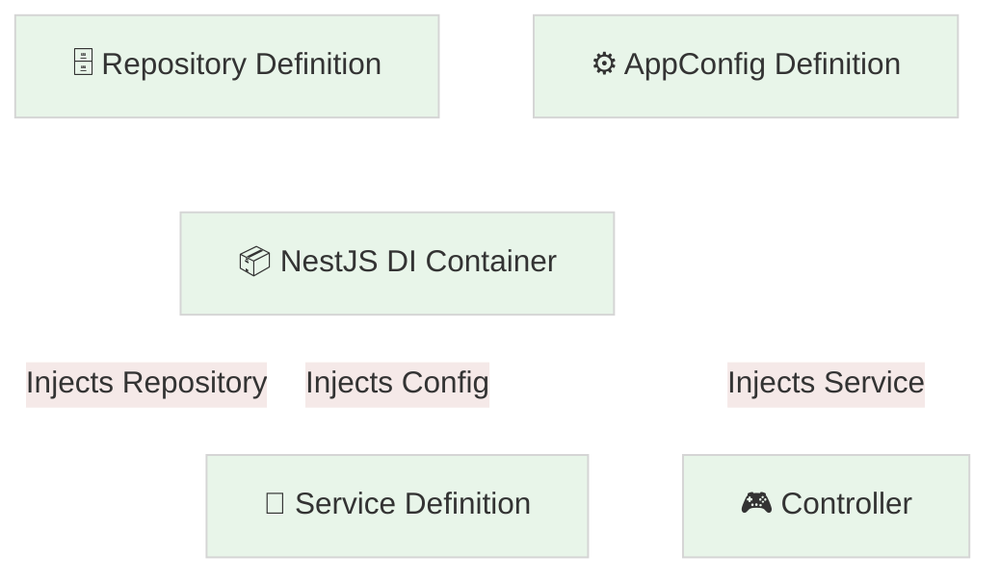
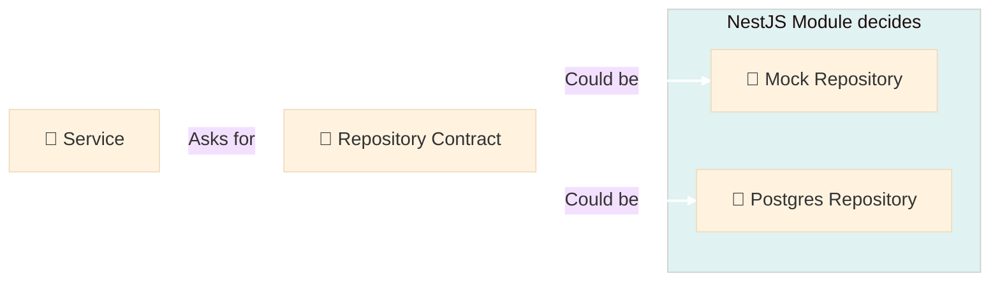

# Module 6, Second Week Day 3 - The Master of Injection

Welcome to Day 7! Today, we're going deep into the "magic" that makes NestJS so powerful: **Dependency Injection (DI)**. If Controllers and Services are our building blocks, DI is the advanced crane that automatically places them exactly where they need to go, without us having to lift a finger.

---

## 🏗 Understanding the DI Container

Think of the NestJS **DI Container** as a high-tech warehouse. You don't go and build a "Service" yourself; you tell the warehouse how to build it (using `@Injectable`), and when a "Controller" needs it, the warehouse delivers a fresh (or cached) copy automatically.


```mermaid
%%{init: {'theme': 'base', 'themeVariables': { 'primaryColor': '#e8f5e9', 'edgeColor': '#ffffff', 'tertiaryColor': '#fffdff', 'lineColor': '#ffffff'}}}%%
graph TD
    RepoDef[🗄️ Repository Definition] --> Container[📦 NestJS DI Container]
    ConfigDef[⚙️ AppConfig Definition] --> Container
    ServiceDef[🧠 Service Definition] --> Container

    Container -- "Injects Repository" --> ServiceDef
    Container -- "Injects Config" --> ServiceDef
    Container -- "Injects Service" --> Controller[🎮 Controller]

    linkStyle default stroke:#ffffff,stroke-width:2px
```

### Why do we use DI?

Without DI, you'd be doing `const service = new MyService(new MyRepo())` inside every controller. This is called **Hard Coupling**. If `MyRepo` changes, you'd have to update _every_ controller. With DI, you only change the definition in the **Module**, and Nest handles the rest.

---

## 🔄 Inversion of Control (IoC): Flipping the Script

In traditional programming, your code controls the flow. In **IoC**, you give that control to the framework. You don't say "I want _this specific_ Repository"; you say "I want _something_ that looks like a Repository."


```mermaid
%%{init: {'theme': 'base', 'themeVariables': { 'primaryColor': '#fff3e0', 'edgeColor': '#ffffff', 'tertiaryColor': '#e0f2f1', 'lineColor': '#ffffff'}}}%%
graph LR
    Service[🧠 Service] -- "Asks for" --> Interface[🧱 Repository Contract]
    Interface -- "Could be" --> MockRepo[🧪 Mock Repository]
    Interface -- "Could be" --> RealRepo[🐘 Postgres Repository]

    subgraph "NestJS Module decides"
    MockRepo
    RealRepo
    end

    linkStyle default stroke:#ffffff,stroke-width:2px
```

This makes your code incredibly **Testable**. You can swap a real database for a mock one in your tests just by changing one line in your test module!

---

## 🛠 Advanced Tools: Custom Providers

Sometimes, a simple class isn't enough. Nest gives us specialized tools for complex situations:

### 1. The Constant: `useValue`

Used when you have a fixed object (like a configuration) that you want to share across the app. We used this for our `APP_CONFIG` in `src/common/config/app-config.provider.ts`.

```typescript
{
  provide: 'APP_CONFIG',
  useValue: { version: '1.2', name: 'NestJS Course' }
}
```

### 2. The Smart Builder: `useFactory`

This is the "Genius" provider. It’s a function that can run logic to decide _how_ to create your dependency. We used this in `ProductsModule` to instantiate our repository:

```typescript
{
  provide: ProductRepository,
  useFactory: () => {
    // We could check process.env.DB_TYPE here!
    return new ProductRepository();
  }
}
```

### 3. The Proxy: `useClass`

Used to tell Nest: "Whenever someone asks for `ServiceA`, give them an instance of `ServiceB` instead." Great for refactoring legacy code!

---

## 📖 Glossary & Syntax Guide (Day 7 Update)

| Term / Syntax       | Function           | What is it?                                                                          |
| :------------------ | :----------------- | :----------------------------------------------------------------------------------- |
| **DI Container**    | **The Warehouse**  | The internal system that manages and instantiates all your providers.                |
| **IoC**             | **Design Pattern** | "Don't call us, we'll call you." Giving control of object creation to the framework. |
| **Provider**        | **The Product**    | Any object/class that can be injected into another component.                        |
| **Injection Token** | **The Catalog ID** | A unique key (string or symbol) used to look up a provider (like `APP_CONFIG`).      |
| **`@Inject()`**     | **Manual Request** | Used to inject providers that aren't classes (like strings or custom tokens).        |
| **`useValue`**      | **Static Data**    | A provider type for objects, strings, or numbers.                                    |
| **`useFactory`**    | **Dynamic Logic**  | A provider type that uses a function to create the dependency.                       |
| **`useClass`**      | **Alias/Swap**     | A provider type that swaps one class for another.                                    |

---

## 💡 Key Takeaways

Today, we’ve moved from "just writing code" to "architecting systems." By mastering Dependency Injection and IoC, you’ve made your NestJS application infinitely more flexible, testable, and maintainable.

---

## ✍️ Author

**Alvian Zachry Faturrahman**

- Web: [alvianzf.id](https://alvianzf.id)
- LinkedIn: [alvianzf](https://linkedin.com/in/alvianzf)
