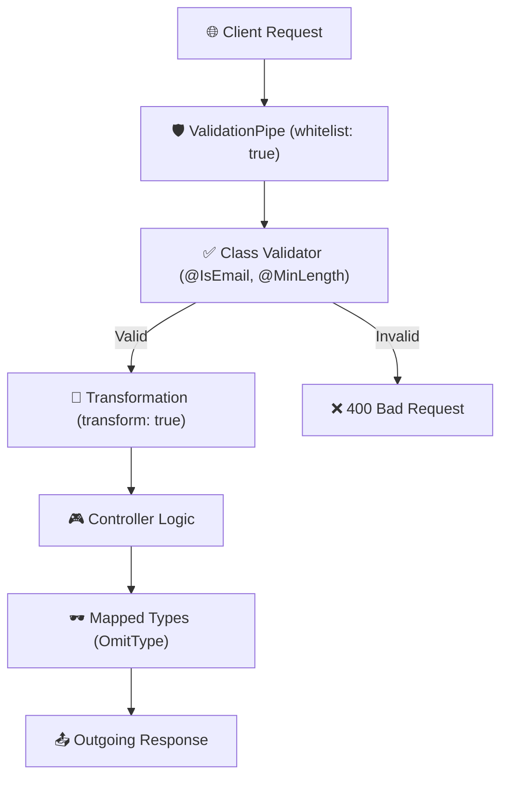
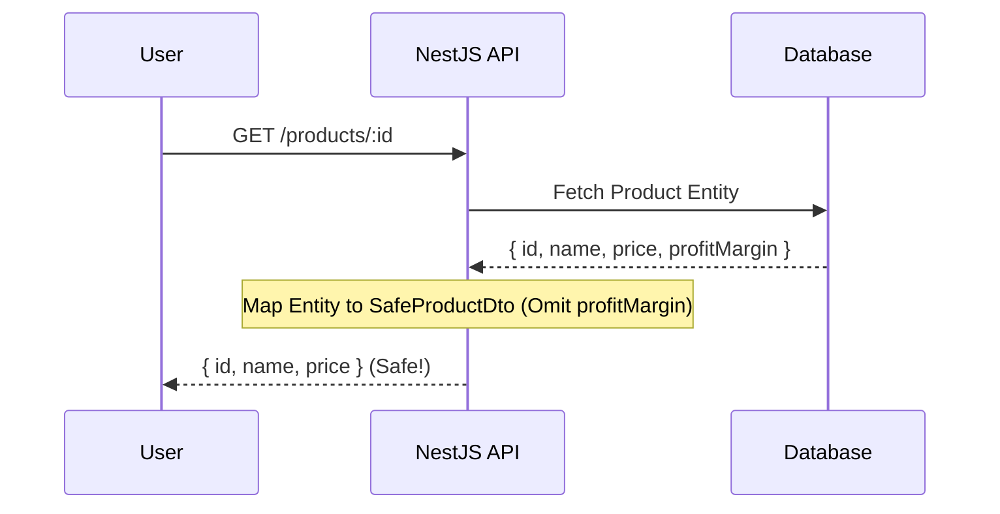

# Additional Lesson: Security Best Practices in NestJS

Security is not just about authentication and authorization; it's also about how you handle data entering and leaving your system. In NestJS, **DTOs** and **Pipes** are your first line of defense.

## 🛡️ The Defensive Layers



### 1. Type Security & Validation

By using `ValidationPipe` with `whitelist: true`, you ensure that only the properties you defined in your DTO are allowed to enter your service. This prevents **Mass Assignment** vulnerabilities.

#### Example: Prevent arbitrary role changes
If a user tries to send `"role": "admin"` to a registration endpoint, but your `CreateUserDto` doesn't include it, NestJS will strip it away automatically.

### 2. Data Transformation

Using `transform: true` in `ValidationPipe` makes your code cleaner and safer. It automatically converts string IDs from URLs into numbers, ensuring you don't perform mathematical operations on strings.

### 3. Masking Sensitive Data (Mapped Types)

Never return passwords or secret keys to the client. Use `OmitType` to create "Safe" versions of your DTOs.

```typescript
// Define original user
export class UserDto {
  username: string;
  email: string;
  password: string; // Sensitive!
}

// Create safe version
export class SafeUserDto extends OmitType(UserDto, ['password']) {}
```

## 🏗️ Case Study: The "Secret Field" Vulnerability

Imagine a `Product` entity with a `profitMargin` field that only internal admins should see.

1.  **Vulnerability**: A developer uses the same `Product` class for both Database and Response.
2.  **Attack**: A malicious user calls `GET /products/1` and sees the internal `profitMargin`.
3.  **Fix**: Use `PickType` or `OmitType` to define exactly what the API returns.



---

## 🌳 Tree Structure

```text
📁 src
├── 📁 users
│   ├── 📁 dto
│   │   ├── 📄 create-user.dto.ts (Validation & OmitType)
│   │   └── 📄 update-user.dto.ts (PartialType)
│   └── 📄 users.service.ts (Implements masking)
└── 📄 main.ts (Global pipe configuration)
```
