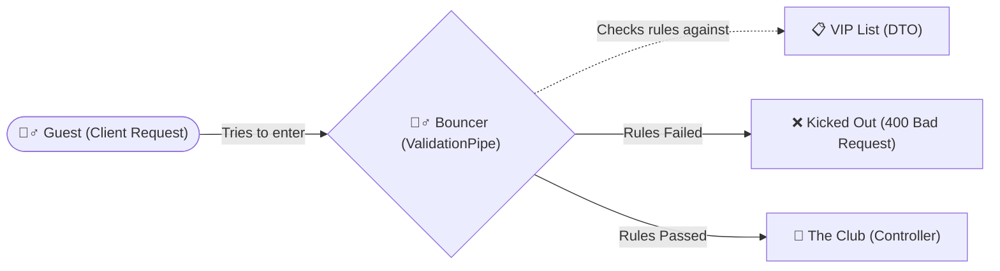
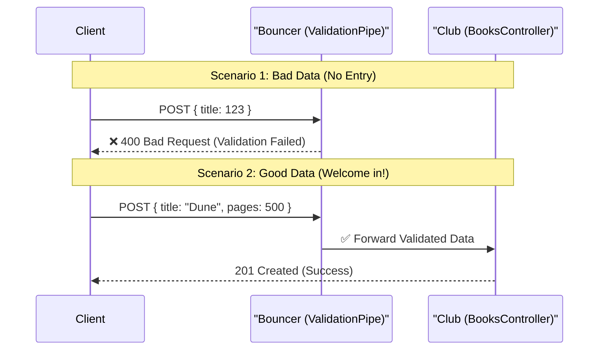

# Validation & DTOs: The Bouncer at the Club

## TL;DR

- **Validation:** Checking that the data a user sends us is exactly what we requested, in the correct format, and safe to use.
- **DTO (Data Transfer Object):** A clear list of rules defining what that data must look like.
- **Why it matters:** Without it, users can break our application, insert malicious data, or cause the server to crash.

---

## Why Validation Matters (And Why Backend Developers ALWAYS Care)

Imagine a Backend Developer is the owner of a very exclusive club (your database).

If you just leave the front door open, anyone can walk in. People might bring in outside drinks, someone might try to sneak in a pet, or worse, someone with bad intentions might walk right in.

To protect the club, you hire a **Bouncer**. The Bouncer stands at the door with a VIP list and a set of rules:

1. "You must be 18+."
2. "No sneakers allowed."
3. "You must have a ticket."

In the backend world, **Validation is your Bouncer.**



### What Happens Without Validation?

Let's look at our Book API. We expect a user to send us a book like this to create it:

```json
{
  "title": "Harry Potter",
  "author": "J.K. Rowling",
  "pages": 300
}
```

If we **don't** validate the incoming data, a user (or a hacker) could send us this:

```json
{
  "title": 12345,
  "author": null,
  "pages": -500,
  "isAvailable": "maybe",
  "secretHackCode": "DROP TABLE books;"
}
```

If our backend blindly accepts this data and tries to save it to our database:

1. **The Server Crashes:** The database expects a `string` for the title, but gets a `number`.
2. **Bad Data:** We now have a book with -500 pages. That makes no sense.
3. **Security Vulnerabilities:** The user sent a `secretHackCode` that we didn't ask for. If our database is poorly configured, it might actually execute that code and delete everything.

**As a Backend Developer, your #1 rule is:** _Never, ever trust data coming from the outside._ Always assume the user will make a mistake, or someone is actively trying to break your app.

---

## Enter the DTO (Data Transfer Object)

If Validation is the Bouncer checking people at the door, the **DTO** is the physical VIP List / Rulebook the Bouncer holds.

A DTO is just a TypeScript class that defines exactly what data we expect from the client when they make a request (like a POST or PUT request).

**Where do DTOs live?**
We group them by feature in a `dto` folder:

```text
src/
└── books/
    ├── dto/
    │   ├── create-book.dto.ts     # Rules for creating a book
    │   └── update-book.dto.ts     # Rules for updating a book
    ├── books.controller.ts
    └── books.service.ts
```

### Building the Rulebook

Let's look at how we build a DTO using `class-validator` (a library that gives us easy-to-read rules).

```typescript
import { IsString, IsNumber, IsNotEmpty, Min } from 'class-validator';

export class CreateBookDto {
  @IsString()
  @IsNotEmpty()
  title: string;

  @IsString()
  @IsNotEmpty()
  author: string;

  @IsNumber()
  @Min(1)
  pages: number;
}
```

### Breaking Down the Rules (Decorators)

Notice the `@` symbols above our properties? Those are called **Decorators**. They are the specific instructions for our Bouncer:

- `@IsString()`: "This must be text. If they send a number or a boolean, reject them."
- `@IsNotEmpty()`: "This cannot be blank. If they try to send an empty string `""`, reject them."
- `@IsNumber()`: "This must be a number."
- `@Min(1)`: "This number cannot be less than 1. A book must have at least 1 page."

### How the Bouncer Actually Works (ValidationPipe)

We have our rules (DTO), but who actually enforces them?

In NestJS, we use a **Pipe**, specifically the `ValidationPipe`. A Pipe intercepts the request _before_ it hits your Controller logic.



By adding `app.useGlobalPipes(new ValidationPipe())` to your `main.ts` file, you are hiring a Bouncer for every single door in your entire application.

### The "Whitelist" Feature (Stripping Extra Data)

Remember that hacker who sent `secretHackCode: "DROP TABLE books;"`?

The NestJS ValidationPipe has an amazing feature called **Whitelisting**. If you turn it on, the Bouncer will look at the DTO (the VIP list). If the user sends a property that is _not_ on the list, the Bouncer silently strips it away and throws it in the trash before letting the rest of the valid data through.

```typescript
// main.ts
app.useGlobalPipes(
  new ValidationPipe({
    whitelist: true, // Only allow properties defined in the DTO
  }),
);
```

### Summary

1. **Validation** ensures your data is clean, predictable, and safe.
2. **DTOs (Data Transfer Objects)** provide the exact shape and rules for what the data must look like.
3. We use **Decorators** (`@IsString()`) to easily define those rules.
4. The **ValidationPipe** acts as the Bouncer, enforcing the DTO rules before the request ever reaches your actual code.
