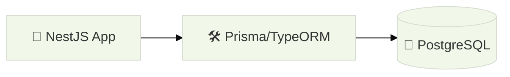

# ADR 1: Use PostgreSQL as the Primary Database

**Status:** Accepted  
**Date:** 2024-03-06  
**Decider:** Alvian (Instructor)

## 1. Context

Our application needs to store book inventory and handle transactions when books are borrowed. We require strong data consistency (ACID compliance) and the ability to perform complex relational queries (e.g., "Find all books borrowed by users who have a specific role").

## 2. Decision

We will use **PostgreSQL** as our primary relational database. We will also use **TypeORM** or **Prisma** to interact with the database from our NestJS code.

## 3. Options Considered

- **MongoDB:** Flexible schema but harder to maintain complex relationships and strict data integrity for inventory.
- **SQLite:** Great for local development but not suitable for high-traffic production environments.

## 4. Consequences

- **Positive:** We get strong data integrity, powerful SQL features, and a mature ecosystem in the industry.
- **Negative:** We need to manage database migrations and a fixed schema, which takes more planning than a NoSQL approach.
